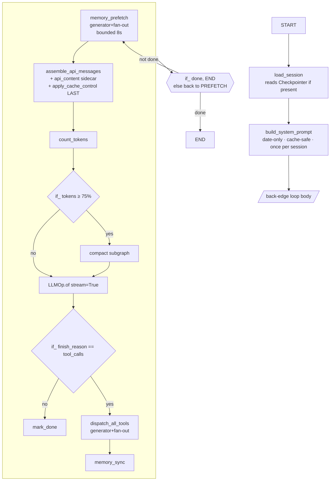

# Operonx → Agent Framework — Extension Plan (v2, post-1.0.0)

**Status:** rewrite of the pre-1.0.0 draft (preserved as
`AGENT_EXTENSION_PLAN.md.v1.bak`). This version composes on top of the
primitives that shipped in operonx 1.0.0 (2026-08-10): back-edge loops,
`PARENT.declare(reducers={...})`, `Checkpointer`, `InterruptOp`,
`engine.stream(mode=…)`, `LLMOp.of(fields=…, max_retries=…)`, filtered
observability via `@op(exclude=…, include=…, observe_max=…)`, and the
`operonx.reducers` module (`add_messages`, `dict_merge`).

**TL;DR** — 1.0.0 turned operonx into a real agent substrate. What v1 had
to build defensively (message accumulation, HITL branches, loop scaffolding,
retry supervisors, tracing filters) now ships in-framework. This plan adds
**one small package (`operonx/agents/`)**: a `@tool` decorator, a per-call
dispatch subgraph, a ReAct-loop factory, a sub-agent factory, and a handful
of pure-Python helpers. **~13 files, most under 200 LOC**, and the reference
harness (`operonx-code`) built on top. Nothing invents a "framework layer" —
we compose primitives already blessed by 1.0.0.

---

## 1 · Why now (what 1.0.0 changed)

The pre-1.0.0 plan had to work around six missing primitives. All six shipped.
The table below is the load-bearing delta — every row erased a v1 workaround.

| Concern | v1 workaround | 1.0.0 primitive | Effect on this plan |
|---|---|---|---|
| Message accumulation across turns | Custom `append_messages` op with hand-written LangGraph-style id-upsert | `PARENT.declare(messages=[], reducers={"messages": add_messages})` | Delete custom merger. Turn output writes with `>> PARENT["messages"]`; framework merges. |
| Loop control | `with GraphOp.loop(name=…, until="expr", **initial_state) as loop:` | Back-edge inside `@graph` → Phase 3 synthesizes hidden `_GraphLoop`. `strict_dag=True` opts out. | ReAct loop is a plain `@graph` with `if_(done, END).else_(llm)`. No imperative scaffolding. |
| HITL / permission on destructive tools | Runtime `if_` branch reading a mode flag; hoped a human polled a queue somewhere | `InterruptOp(payload=…, timeout=…)` — emits `InterruptEvent` on state's bus, awaits `state._interrupt_responses[id]`. `engine.stream()` auto-subscribes a listener; `handle.resume(id, value)` resolves. | `permission_gate` becomes a `Wait(InterruptOp) → if_ approve.else_ block` pattern. Real preempt, real resume. |
| Structured LLM output + retry | Separate ParserOp + custom retry loop in `ask()`; hallucinated a fallback trigger on parse errors | `LLMOp.of(fields=…, parser=…, validators=…, max_retries=…, retry_hint=True)` — inline parse + validate + Instructor-style error-guided retry on the same resource. Fallback narrowed to structural refusals only. | Router/classifier ops disappear into LLMOp calls with `fields=`. Retry taxonomy is honest: parse/validate → `max_retries`, refusal → `fallback`, transport → SDK. |
| Cross-turn state visibility / replay | Ad-hoc SCRATCH scraping | `Checkpointer` protocol + `InMemoryCheckpointer` — per-step delta store; `get_state(step)`, `get_updates(step)`, `list_steps()`. Zero overhead when unbound. | Sessions become "bind a checkpointer, replay the graph." Nothing custom in the agent layer. |
| Progress streaming to consumer | Peek into `ExecutionHandle._queue` | `engine.stream(mode="custom", channels=[…])` + `EmitOp` — fire-and-forget custom events with channel filtering. `mode="updates"` for per-op deltas; `mode="values"` for full-state snapshots (needs checkpointer). | Progress events are `emit(channel="tool_start", …)` — no framework changes. |
| Observability shaping | Hand-filtered per-op | `@op(exclude=…, include=…, observe_max=…)` — polymorphic list-or-dict; `ObserveBudgetExceeded` circuit-breaks runaway generators. | Prompt-cache defense, chunk-heavy streams, and tool-output truncation all shape at emission source. No tracer-side filter code. |

Two other cleanups that ripple through the plan:

- **`PARENT.shared(**vars)` was renamed to `PARENT.declare(**vars, reducers={…})`.** All the v1 shared-state examples get one line simpler and gain a merge policy.
- **`ask()` was removed.** `LLMOp.of(fields=…)` is the one canonical LLM shorthand. Nothing to teach twice.

**Net effect on scope:** v1 estimated 3–4 weeks compressed to 2–3. This
revision compresses further, to **~2 weeks for P0–P3**, because five of the
seven load-bearing scaffolds (message merge, loop, HITL, retry, streaming)
are framework code we no longer write.

---

## 2 · What operonx 1.0.0 primitives you compose on

These are the substrate. Every op-native construct in this plan resolves
back to one of these.

| Concern | Primitive | Evidence |
|---|---|---|
| Turn loop | Back-edge inside `@graph` — Phase 3 build-time rewrite synthesizes `_GraphLoop`; `max_iterations=1000` default cap; `strict_dag=True` opts out | `graph_op.py` · `cycle_rewrite.py` · [docs/design/STATE_LOOP_REFACTOR_PLAN.md](docs/design/STATE_LOOP_REFACTOR_PLAN.md) |
| LLM streaming | `LLMOp.of(stream=True, …)` yields per token chunk; frames forwarded to `ExecutionHandle._queue` | `providers/ops/llm.py:_generate_core` · `engine.py:start` |
| Structured LLM output | `LLMOp.of(fields=[…], parser="json"\|"xml"\|"yaml", validators={…}, max_retries=N, retry_hint=True)` — parse + validate + semantic retry on same resource | `providers/ops/llm.py:_structured_generate` |
| Refusal vs parse failure | Structurally-detected `LLMRefusalError` (finish_reason ∈ {content_filter, safety} or non-empty `extras.refusal`) triggers `fallback=`; parse/validator failures use `max_retries` on the primary | `providers/ops/llm.py:_is_refusal` · MIGRATION.md §Runtime |
| Sub-agent isolation | Nested `@graph` — child ops live at deeper `ctx` tuple; parent refs hermetic (validated at build); nested trace spans auto-nest | `graph_op.py` · [docs/architecture/state-model.md](docs/architecture/state-model.md) |
| Shared cells + reducers | `PARENT.declare(**vars, reducers={var: fn(old,new)→merged})` — cell semantics + optional fan-in merge | `_edges.py:PARENTAccessor.declare` |
| Message accumulation | `operonx.reducers.add_messages` — LangGraph-compatible id-upsert + `RemoveMessage` / `REMOVE_ALL_MESSAGES` sentinels | `operonx/reducers.py` |
| Tool fan-out | Generator op yielding per tool call + `Ref.parallel(max=N)` on consumer | `ref.py:parallel` · `task_scheduler.py` |
| Ordered gather | `Ref.collect()` — buffered, flushed at EOF in yield-index order | `task_scheduler.py:_on_eof` · `ref.py:collect` |
| Preemptive cancel | `yield Interrupt(ctx_to_cancel=…)` from any op — scheduler drains pumps at that ctx prefix | `_events.py` · `task_scheduler.py` |
| **HITL suspend/resume** | **`InterruptOp(payload=…, timeout=…)` — emits `InterruptEvent`, awaits `state._interrupt_responses[id]`; outputs `response`, `timed_out`, `interrupt_id`** | `core/ops/flow/interrupt_op.py` |
| **Cross-run persistence** | **`Checkpointer` protocol + `InMemoryCheckpointer` (Phase 2). Bind at `Operon(g, checkpointer=…)`. `handle.get_state(step)`, `handle.list_steps()`. Zero overhead when unbound** | `checkpoint/base.py` · `checkpoint/memory.py` |
| **Custom progress events** | **`EmitOp(channel=…, payload=…)` + `engine.stream(mode="custom", channels=[…])` — fire-and-forget filterable event bus** | `core/ops/flow/emit_op.py` · `engine.py:stream` |
| **Observability shaping** | **`@op(exclude=[…], include=[…], observe_max=N)` — polymorphic filter at emission source; `ObserveBudgetExceeded` on runaway generators** | `core/ops/base.py` |
| Async I/O dispatch | `@op(bound="io"\|"cpu"\|"sync")` — auto thread-pool routing | `core/ops/base.py` |
| Config + secrets | `ResourceHub` — singleton, lazy, `resources.yaml`, `${VAR}` interpolation, 5-branch diagnostic errors | `core/registry/resource_hub.py` |
| Per-run scratchpad | `SCRATCH[key]` — free-form dict on `MemoryState._scratch`; mutations flow through the observer bus (Phase 2b3 B1) | `core/ops/_edges.py:ScratchAccessor` |

**You will build the agent by writing `@op`s and `@graph`s that plug into
this substrate. You will not re-implement any of the above.**

---

## 3 · The mental-model shift (unchanged from v1, sharper now)

Every "class" a hermes-style agent framework would demand either
**dissolves into an operonx primitive** or **shrinks to a thin
pure-Python helper**. 1.0.0 dissolves five more that v1 kept as ops.

| A hermes-style class | Op-native form | Notes |
|---|---|---|
| `TurnController` | Back-edge inside `@graph` — Phase 3 rewrite | v1 had `GraphOp.loop`; 1.0.0 collapses to DAG-native. |
| `LLMClient` | `LLMOp.of` | Simple + structured mode in one class. |
| `Tool` (the LLM-callable thing) | **`ToolOp(BaseOp)` — first-class primitive (§7.1)** | The one deliberate new class in this plan. Everything else in the table dissolves. See §7.1a for the "op-worthy" criteria. |
| `ToolDispatcher` | Thin subgraph over `ToolOp.dispatch()` (§7.2) | 3 ops + 2 branches per call — dispatch protocol lives on ToolOp. |
| `SubAgent` | Nested `@graph` (§7.4) | Free ctx isolation + trace nesting. |
| `Permission` engine | **`InterruptOp` → `if_(response.approved).else_(blocked)`** | v1 had a runtime branch on a stashed mode flag; 1.0.0 gives real HITL. |
| `MessageStore` / accumulator | **`PARENT.declare(messages=[], reducers={"messages": add_messages})`** | v1 wrote a custom merger op; framework ships one. |
| `SessionStore` | **`Checkpointer` binding** | v1 was a resource-registered SQLite class; 1.0.0 gives replay for free. |
| `ProgressStream` / eventer | **`EmitOp` + `engine.stream(mode="custom")`** | v1 sniffed the frame queue; 1.0.0 has a bus. |
| `RetrySupervisor` (parse errors) | **`LLMOp.of(max_retries=N, retry_hint=True)`** | v1 was a ~40-LOC ask() loop; 1.0.0 has Instructor-style semantic retry inline. |
| `Tracer` filter | **`@op(exclude=…, include=…, observe_max=…)`** | v1 filtered downstream; 1.0.0 filters at emission source. |
| `PromptAssembler` | `build_system_prompt` op | Pure fn wrapped in an op. |
| `Compactor` (algo) | `compact` subgraph + `if_` gate | Data-flow rewrite of messages. |
| `ToolRegistry` | Python dict `{name: op_factory}` | Built at import time. |
| `ErrorClassifier` | Pure function `(exc) → ErrorKind` + `if_` | No I/O, no state. |
| `MemoryProvider` ABC + backends | Classes in `ResourceHub`; methods wrapped as ops | Same. |
| `SkillLoader` (YAML parse) | Pure function at agent init | One-shot. |
| `Agent` composition root | ~30-LOC factory building the top-level `@graph` | Not a class. |

**Net effect:** the "12-module decomposition" from v1 collapses further.
Ten of the boxes above are now zero-LOC on our side — 1.0.0 handles them.
One (`Tool` → `ToolOp`) is a deliberate first-class primitive, one class,
~120 LOC (§7.1). The rest are thin `@op` + pure-Python helpers. What
remains is ~13 small files, most under 200 LOC.

---

## 4 · Module layout

```
operonx/agents/                    (NEW · blessed primitives · in-tree)
├── __init__.py                    # public surface: ToolOp, tool, TOOL_REGISTRY,
│                                  #                 build_react_agent, subagent
├── CONTRIBUTING.md                # Footprint Ladder governance
│
├── tool.py                        # ToolOp(BaseOp) class · @tool shorthand · TOOL_REGISTRY dict
│                                  # · _param_to_json_schema + _tool_message + _truncate helpers
├── errors.py                      # ClassifiedError + pure classify()
├── memory.py                      # MemoryProvider ABC ONLY (no MemoryOp — see §7.1a)
│                                  # + LocalMarkdownMemory reference backend
│
├── ops/                           # every file here is thin @op wrappers
│   ├── memory_ops.py              # memory_prefetch (generator+fan-out), memory_sync, memory_write
│   │                              # — thin wrappers around MemoryProvider methods; use case
│   │                              #   varies too much to justify a MemoryOp base class
│   ├── permission_ops.py          # permission_check (policy); wraps InterruptOp when needed
│   ├── compact_ops.py             # count_tokens, compact_messages
│   ├── prompt_ops.py              # build_system_prompt, apply_cache_control, assemble_api_messages
│   ├── skill_ops.py               # inject_skills_as_user_msg
│   └── progress_ops.py            # emit_progress helpers (thin EmitOp wrappers with typed payloads)
│
├── graphs/
│   ├── dispatch.py                # dispatch_one subgraph + dispatch_all_tools fan-out (§7.2)
│   ├── react.py                   # ReAct back-edge loop factory (§7.3)
│   └── subagent.py                # sub-agent nested-@graph factory (§7.4)
│
└── skills/
    └── loader.py                  # SKILL.md YAML frontmatter parser
```

**What's NOT in `operonx/agents/`** (deliberate boundary):

- **RAG ops** (`RerankOp` today, potential future `VectorSearchOp`,
  `HybridSearchOp`) live in `operonx/providers/ops/*` — same tier as
  `LLMOp`/`EmbeddingOp`. RAG is a *provider* concern; the agent
  framework consumes it via `LLMOp` inputs, doesn't own it. Blurring
  RAG into "memory" would fight the community's mental model (LangChain
  / LlamaIndex / Haystack all separate the two) and force
  `MemoryProvider` to grow a `.search()` method that half its backends
  won't implement.
- **`ToolOp` is the one exception to "no first-class agent op"** — see
  §7.1a for why. No `PermissionOp`, `CompactionOp`, or `SkillOp` — each
  fails the 4-criteria bar; each is a plain `@op` + helper module.

Also in tree:

```
operonx/cli/                        (renamed from operonx/tools/ — namespace fix)
```

Rename is still valid — `operonx/tools/` currently holds `operonx-pack`
(a Rust-spec serializer CLI). Freeing the `tools` name for agent tooling
avoids a permanent semantic clash.

Out of tree (sibling PyPI package, iterates independently):

```
operonx-code/                       # reference coding-agent harness
```

---

## 5 · The agent as a graph — end-to-end shape



Every box is either an `@op` we write (~10–100 LOC each) or an existing
operonx op (`LLMOp`, `if_`, `EmitOp`, `InterruptOp`). No god-class. The
loop back-edge `BACK -->|not done| PREFETCH` is what the Phase 3 rewrite
turns into a synthesized `_GraphLoop` at build time.

---

## 6 · Design rules

### Rule 1 — Yield + fan-out beats imperative iteration

From operonx's own history: the classic `ForOp` / `MapOp` / `WhileOp`
classes were replaced by `yield` + downstream fan-out because it collapses
`for`, `map`, `while`, and *streaming* into a single primitive. **Never
write a `for` loop inside an op if you can yield instead.** A generator op
+ `Ref.parallel(max=N)` downstream gives you per-item concurrency, per-item
trace spans, per-item ctx isolation, and streaming-to-caller — all four for
free.

**Before** (imperative, hides parallelism, breaks streaming):

```python
@op
async def prefetch_all(query, providers):
    results = []
    for p in providers:
        results.append(await p.prefetch(query))   # sequential I/O
    return {"contexts": results}                  # batched result
```

**After** (yields, downstream fans out, streams naturally):

```python
@op
def each_provider(providers: list):
    for p in providers:
        yield {"provider": p}

@op
async def one_prefetch(query: str, provider):
    return {"context": await provider.prefetch(query)}

# In the graph:
gen    = each_provider(providers=PARENT["memory_providers"])
one    = one_prefetch(query=PARENT["query"], provider=gen["provider"].parallel(max=4))
merged = merge_contexts(items=one["context"].collect())   # ordered gather at EOF
```

Apply everywhere iteration is *independent* — tool dispatch (§7.2), memory
prefetch (§7.5), skill matching (§7.5), sub-agent fan-out (§7.5), LLM token
consumers (§7.5). The one place iteration is *dependent* is the outer ReAct
loop (turn N+1's LLM input depends on turn N's tool results) — that's what
back-edges are for.

### Rule 2 — Loops go through back-edges, never imperative wrappers

The v1 plan hedged that `GraphOp.loop` was the framework's "one imperative
primitive." 1.0.0 fixed that. **Every loop in the agent — outer ReAct,
inner retry, sub-agent turns — is a back-edge inside a `@graph`.** The
Phase 3 rewrite compiles it into a hidden `_GraphLoop` at build time; you
never touch the loop wrapper.

### Rule 3 — Reducers own accumulation, not custom ops

If a cell accumulates across turns (messages, cost, tool-call log), declare
it with a reducer:

```python
import operator
from operonx.reducers import add_messages, dict_merge

PARENT.declare(
    messages=[],
    cost_usd=0.0,
    tool_stats={},
    reducers={
        "messages": add_messages,      # LangGraph id-upsert + RemoveMessage sentinels
        "cost_usd": operator.add,
        "tool_stats": dict_merge,
    },
)
```

No `append_messages` op. No manual merge. Each turn's op writes with
`>> PARENT["messages"]`; the framework merges under a bounded lock.

### Rule 4 — Retry taxonomy is honest

Three failure modes, three primitives. Don't cross the streams.

| Failure mode | Symptom | Handler | Where |
|---|---|---|---|
| Transport | 429, 5xx, connection reset, timeout | SDK's own retry (litellm / openai / anthropic) | Under LLMOp, invisible |
| Parse / validate | JSON malformed, field missing, validator rejects | `LLMOp.of(max_retries=N, retry_hint=True)` — retries on **same resource** with the error injected into the next prompt | LLMOp inner loop |
| Refusal / content-filter | `finish_reason ∈ {content_filter, safety}` or non-empty `extras.refusal` | `LLMOp.of(fallback=[…])` — tries next model | LLMOp fallback chain |
| Semantic ("bad" answer that parsed fine) | Answer is correctly formed but wrong for the task | Agent-level: another loop iteration or self-critique | ReAct loop body |

**No transport-retry knob on LLMOp** — the SDK is battle-tested. A wrapping
retry would just double the exponential backoff.

---

## 7 · Core sketches

### 7.1 · `ToolOp` — the one new first-class op

**Design call:** `ToolOp` is a real `BaseOp` subclass alongside `LLMOp`,
`EmbeddingOp`, `RerankOp`, `InterruptOp`, `EmitOp`. See §7.1a for the
"op-worthy" criteria and why tool clears the bar and memory doesn't.

```python
# operonx/agents/tool.py
from typing import Any, Callable, Dict, Optional
from operonx.core.ops import BaseOp
from operonx.core.utils.common import Param
from operonx.core.configs import OpType

TOOL_REGISTRY: Dict[str, "ToolOp"] = {}

class ToolOp(BaseOp):
    """LLM-callable tool. Wraps a core callable + the metadata the LLM
    provider payload and the HITL dispatcher both need.

    Owns four things (each a real reason it's a class, not a dict):
      1. JSON Schema — synthesized from Param signature + type hints for
         the common cases (str/int/float/bool/enum/list-of-scalars/dict);
         `schema_overrides=` for oneOf/discriminators/complex types.
      2. Dispatch protocol — `.dispatch(tool_call: dict) → tool_message: dict`.
         Parses args, executes via BaseOp.core, wraps the result into the
         `role:"tool"` message the LLM expects. Truncates + tags high-risk
         outputs per `max_result_chars`.
      3. Policy metadata — `destructive`, `readonly`, `concurrency_safe`,
         `check_fn` (TTL-cached availability probe). Read by the dispatcher
         (§7.2) to route through HITL when destructive.
      4. Tracing hooks — the op's span auto-includes `tool_name`,
         `tool_call_id`, and an argument preview (redacted for
         secret-typed params).
    """

    type: OpType = "tool"

    __slots__ = (
        "tool_name", "description", "schema",
        "destructive", "readonly", "concurrency_safe",
        "check_fn", "max_result_chars",
    )

    def __init__(
        self,
        *,
        core: Callable,
        tool_name: str,
        description: str,
        schema: Optional[dict] = None,        # None → synthesize from Param
        schema_overrides: Optional[dict] = None,
        destructive: bool = False,
        readonly: bool = False,
        concurrency_safe: bool = False,
        check_fn: Optional[Callable] = None,
        max_result_chars: int = 100_000,
        **op_kwargs,
    ):
        super().__init__(**op_kwargs)
        self._set_core(core)
        self.tool_name = tool_name
        self.description = description
        self.schema = schema or self._synthesize_schema(overrides=schema_overrides)
        self.destructive = destructive
        self.readonly = readonly
        self.concurrency_safe = concurrency_safe
        self.check_fn = check_fn
        self.max_result_chars = max_result_chars

    def _synthesize_schema(self, *, overrides=None) -> dict:
        """Build an OpenAI-style JSON Schema from self.inputs (Param dict).
        Handles scalars, enums (via Param.choices=), lists of scalars, dicts
        of scalars, Optional/None. Complex shapes must pass `schema=` or
        `schema_overrides={arg_name: {...}}`."""
        properties = {}
        required = []
        for arg_name, param in self.inputs.items():
            if overrides and arg_name in overrides:
                properties[arg_name] = overrides[arg_name]
            else:
                properties[arg_name] = _param_to_json_schema(param)
            if param.required:
                required.append(arg_name)
        return {
            "type": "function",
            "function": {
                "name": self.tool_name,
                "description": self.description,
                "parameters": {
                    "type": "object",
                    "properties": properties,
                    "required": required,
                },
            },
        }

    async def dispatch(self, tool_call: dict) -> dict:
        """Execute a single LLM tool_call and return the tool_message dict
        the LLM should see next. Called by the dispatcher (§7.2).

        On failure, returns a tool_message with an error string — never
        raises. Framework guarantee: the LLM ALWAYS sees a tool_message
        per tool_call, even on internal errors.
        """
        import json
        call_id = tool_call["id"]
        try:
            args = json.loads(tool_call["function"]["arguments"])
        except json.JSONDecodeError as e:
            return _tool_message(call_id, f"error: could not parse args: {e}")

        try:
            raw = await self.core(**args)
        except Exception as e:
            return _tool_message(call_id, f"error: {type(e).__name__}: {e}")

        return _tool_message(call_id, _truncate(raw, self.max_result_chars))


def tool(
    *, name, description,
    schema=None, schema_overrides=None,
    readonly=False, concurrency_safe=False, destructive=False,
    check_fn=None, max_result_chars=100_000,
):
    """Shorthand — wraps a function into a ToolOp and registers it.

    Function signature drives the operonx Param dict (build-time wiring).
    Param dict drives JSON Schema synthesis (LLM payload). One source of
    truth for the common shapes; hand-override for the rest.
    """
    def wrap(fn):
        op_instance = ToolOp(
            core=fn,
            tool_name=name,
            description=description,
            schema=schema,
            schema_overrides=schema_overrides,
            readonly=readonly,
            concurrency_safe=concurrency_safe,
            destructive=destructive,
            check_fn=check_fn,
            max_result_chars=max_result_chars,
            name=name,                    # BaseOp.name (used for graph wiring)
        )
        TOOL_REGISTRY[name] = op_instance
        return op_instance
    return wrap

@tool(
    name="edit",
    description="str_replace edit",
    destructive=True,                     # → dispatcher routes through InterruptOp
)
async def edit_tool(path: str, old: str, new: str) -> dict:
    """path/old/new signature → Param dict → synthesized JSON schema. No
    hand-authored schema needed because all three args are plain strings."""
    ...
    return {"result": diff}
```

**Schema synthesis — what's covered, what's not:**

| Signature shape | Auto-synthesized? | Hand-author needed? |
|---|---|---|
| `x: str`, `n: int`, `f: float`, `b: bool` | ✅ | — |
| `x: Optional[str]` (defaults to None) | ✅ | — |
| `mode: Literal["a", "b", "c"]` | ✅ (via `enum:`) | — |
| `items: list[str]`, `tags: dict[str, str]` | ✅ | — |
| `payload: dict[str, Any]` (opaque) | ✅ (as `type: "object"`) | — |
| `spec: MyPydanticModel` | ⚠️ partial (`type: "object"`) | Pass `schema_overrides={…}` for full shape |
| `variant: Union[TypeA, TypeB]` (oneOf) | ❌ | Pass `schema_overrides={…}` |
| Discriminated unions | ❌ | Pass `schema_overrides={…}` |

**Net effect:** most tools ship with NO hand-authored schema. The "two
schemas per tool" pain that v1 flagged as unavoidable is closed for the
common case — the hard case (oneOf, discriminators, deeply nested pydantic)
still needs a hand-authored override, and that's honest.

### 7.1a · Why `ToolOp` earns a class (and memory doesn't)

The bar for "deserves a dedicated BaseOp subclass" in operonx isn't
arbitrary. Every existing dedicated op (`LLMOp`, `EmbeddingOp`, `RerankOp`,
`TritonOp`, `OnnxOp`, `InterruptOp`, `EmitOp`) hits **all four** of these:

1. **Complex I/O contract** — transport, retries, response shapes that
   users would re-implement badly if left to bare `@op`.
2. **Rich metadata for tracing** — the span carries data the framework
   knows how to render (model, cost, tokens for LLMOp; provider, dim for
   EmbeddingOp; …).
3. **Reusable shape across many use cases** — the signature is stable
   enough that a base class is a real ceiling on variance.
4. **Non-trivial code volume** — enough boilerplate that inheriting from
   the base saves real work, not just aesthetics.

**Tool: 4/4.** JSON schema + args parsing + `role:tool` result contract +
blocked-result contract (complex I/O). Tool name + destructive + readonly
+ check_fn + max_result_chars (rich metadata). Every agent has tools
(reusable). Dispatch + args parse + result wrap + truncate + trace add
up (non-trivial code). Every framework that skimps here reinvents these
wheels badly — LangChain's `BaseTool` is 300 LOC for a reason. Ours is
~120 because operonx primitives (Param, BaseOp lifecycle, tracing) do
half the work.

**Memory: 2/4.** Complex I/O contract? Only sometimes — dict is trivial,
vector-DB is complex but that's the backend, not the memory layer.
Rich metadata? Partial (provider name, cache stats). Reusable shape?
**No** — a chatbot's conversation memory ≠ a coding-agent's file memory
≠ a research-agent's paper memory. A universal MemoryOp signature would
be so generic it stops earning its keep. Non-trivial code? Depends
entirely on backend. **Verdict:** ship `MemoryProvider` as an ABC + thin
`@op` wrappers per use case. No dedicated MemoryOp.

**RAG is a different question** — retrieve→rerank→inject is a specific
pipeline shape with 3-4 dedicated ops of its own. `RerankOp` already
exists in `providers/ops/`. A future `VectorSearchOp` would live there
too. RAG is a *provider concern*, not an *agent concern* — the agent
framework consumes it via LLMOp inputs, doesn't own it.

**One more class the plan does NOT add:** no `PermissionOp`, no
`CompactionOp`, no `SkillOp`. Each hits 1–2 of the 4 criteria; each is
an `@op` + a helper module. If pain accumulates, revisit — but starting
with three speculative base classes is exactly the god-class trap we're
avoiding.

### 7.2 · `dispatch_all_tools` — thin wrapper around `ToolOp.dispatch`

With `ToolOp.dispatch()` owning parse+execute+wrap (§7.1), the dispatcher
shrinks to two responsibilities: fan out per tool_call, and route
destructive calls through `InterruptOp`. That's it.

```python
# operonx/agents/graphs/dispatch.py
from operonx import op, graph, START, END, InterruptOp
from operonx.core.ops.flow import if_
from operonx.agents.tool import TOOL_REGISTRY

@op
def each_call(tool_calls: list):
    """Generator op — one frame per tool call. Downstream fan-out is
    automatic; consumer uses .parallel() for concurrency, .collect() for
    ordered gather."""
    for i, tc in enumerate(tool_calls):
        yield {"call": tc, "index": i}

@op
def lookup_tool(call: dict):
    """Resolve tool from registry — pure. Returns None if unknown so the
    downstream branch can emit an error tool_message rather than crash."""
    name = call["function"]["name"]
    return {"tool": TOOL_REGISTRY.get(name), "call": call}

@op
async def run_tool(tool, call: dict) -> dict:
    """Dispatch one tool_call via ToolOp.dispatch — the tool owns
    args parse + exec + result wrap. Returns {"tool_message": …}."""
    if tool is None:
        return {"tool_message": {
            "role": "tool", "tool_call_id": call["id"],
            "content": f"error: unknown tool {call['function']['name']}",
        }}
    return {"tool_message": await tool.dispatch(call)}

@op
def blocked_result(reason: str, call: dict) -> dict:
    """Rejection short-circuit — LLM must see one tool_message per call."""
    return {"tool_message": {
        "role": "tool", "tool_call_id": call["id"],
        "content": f"blocked: {reason}",
    }}

@graph
def dispatch_one(call):
    """Per-tool-call dispatch. Destructive tools go through InterruptOp;
    everything else runs directly.

    ToolOp.dispatch is called from run_tool — dispatcher never touches
    args parsing or result wrapping. Deleting those responsibilities
    from here (they moved to §7.1) is the whole point of ToolOp.
    """
    looked = lookup_tool(call=call)
    destr_router = if_(looked["tool"].destructive == True,  # noqa: E712
                       "hitl").else_("direct")

    # Direct path — most tools.
    ran_direct = run_tool(tool=looked["tool"], call=looked["call"])

    # HITL path — destructive tools only. InterruptOp emits on the state
    # bus; engine.stream() hands out interrupt_id→Future pairs; caller
    # calls handle.resume(id, {"approved": True/False}) to resolve.
    approve = InterruptOp(
        payload={"tool": looked["tool"].tool_name, "call": looked["call"]},
        timeout=300.0,                    # 5-minute auto-decline
    )
    approve_router = if_(approve["response"]["approved"] == True,  # noqa: E712
                         "run").else_("block")
    ran_approved = run_tool(tool=looked["tool"], call=looked["call"])
    blocked = blocked_result(reason="denied by human", call=looked["call"])

    START >> looked >> destr_router
    destr_router >> ~ran_direct >> END
    destr_router >> ~approve >> approve_router
    approve_router >> ~ran_approved >> END
    approve_router >> ~blocked >> END

@graph
def dispatch_all_tools(tool_calls):
    """Top-level fan-out. .parallel() for concurrency, .collect() for order."""
    gen  = each_call(tool_calls=tool_calls)
    disp = dispatch_one(call=gen["call"].parallel(max=10))
    START >> gen >> disp >> END
    # downstream reads disp["tool_message"].collect() for ordered gather
```

**Compared to v1's dispatch:** ~30 LOC lighter because `parse_call`,
`exec_tool`, `collect_result`, `is_destructive` all moved into `ToolOp`
(where they belong). What remains is pure orchestration: lookup, route
by destructive flag, HITL for the yes branch, run for the no branch.

**What the 9-step pipeline maps to now:**

| # | Step | Where it lives (post-1.0.0 + ToolOp) |
|---|------|--------------------------------------|
| 1 | Interrupt preflight | Scheduler primitive — `yield Interrupt(ctx_to_cancel=…)` |
| 2 | Parse args | **`ToolOp.dispatch` (was `parse_call` op)** |
| 3 | Tool-request middleware | **`ToolOp.dispatch` (fused, cheap)** |
| 4 | Block eval | `lookup_tool` + `if_(tool.destructive, …)` branch |
| 5 | HITL approve (destructive only) | `InterruptOp` — real suspend/resume via `state._interrupt_responses` |
| 6 | Callbacks | Soft `>` edge to observer op, or `EmitOp` for typed progress events |
| 7 | Execute | **`ToolOp.dispatch` → `BaseOp.core(**args)` (was `exec_tool` op)** |
| 8 | Ordered collect | `Ref.collect()` — operonx guarantees yield-index order |
| 9 | Turn budget + drain / steer | Wrap op at loop end + `SCRATCH` for steer message |

### 7.3 · ReAct loop — `@graph` with a back-edge

```python
# operonx/agents/graphs/react.py
from operonx import op, graph, START, END, PARENT
from operonx.core.ops.flow import if_
from operonx.reducers import add_messages
from operonx.providers.ops import LLMOp
from operonx.agents.graphs.dispatch import dispatch_all_tools
from operonx.agents.ops.memory_ops import memory_prefetch, memory_sync
from operonx.agents.ops.compact_ops import count_tokens, compact_messages
from operonx.agents.ops.prompt_ops import assemble_api_messages

def build_react_agent(*, model, tool_schemas, max_iterations=25):
    """Return a @graph factory implementing one full ReAct turn as a
    back-edge loop. The loop body is the graph body; the back-edge from
    `sync` back to `prefetch` (guarded by `if_(done, END).else_(prefetch)`)
    is what Phase 3 rewrites into a synthesized `_GraphLoop`.

    `max_iterations` becomes the cap on the synthesized loop (default 1000);
    the branch is your primary exit.
    """

    @graph(max_iterations=max_iterations)
    def react_body():
        # Shared cells with reducers. `add_messages` is LangGraph-compatible:
        # id-upsert, RemoveMessage sentinels, REMOVE_ALL_MESSAGES supported.
        PARENT.declare(
            messages=[],
            done=False,
            reducers={"messages": add_messages},
        )

        # Memory prefetch — see §7.5 for the multi-provider generator+parallel form.
        prefetch = memory_prefetch(query=PARENT["messages"])
        assemble = assemble_api_messages(
            messages=PARENT["messages"],
            memory_context=prefetch["context"],
        )
        tokens   = count_tokens(messages=assemble["messages"])

        compact  = compact_messages(messages=assemble["messages"])
        gate1    = if_(tokens["count"] >= assemble["threshold"], compact).else_(assemble)

        llm      = LLMOp.of(
            resource=model,
            stream=True,
            messages=gate1,                # fan-in: either the compacted or original path
            tools=tool_schemas,
        )
        disp     = dispatch_all_tools(tool_calls=llm["tool_calls"])
        sync     = memory_sync(new_messages=disp["tool_message"].collect())

        # Turn writes accumulate into shared cells via reducers.
        llm["assistant_message"]     >> PARENT["messages"]
        sync["tool_messages"]        >> PARENT["messages"]
        llm["done"]                  >> PARENT["done"]     # done when finish_reason != tool_calls

        START >> prefetch >> assemble >> tokens >> gate1 >> llm
        # Router: no tool_calls → done, back-edge to END; else dispatch and loop back.
        llm >> if_(llm["done"] == True, END).else_(disp)     # noqa: E712
        disp >> sync
        sync >> prefetch                                     # back-edge closes the loop

    return react_body
```

That is the entire agent turn. ~35 lines including whitespace. Compare with
v1's `with GraphOp.loop(name="react", until="stop_reason == 'end_turn'", …)`
scaffold — same behaviour, no imperative wrapper.

### 7.4 · Sub-agent = nested `@graph`

```python
# operonx/agents/graphs/subagent.py
from operonx import op, graph, PARENT, START, END
from operonx.reducers import add_messages
import operator

DELEGATE_BLOCKED_TOOLS = frozenset(["delegate", "memory", "clarify", "send_message"])

@graph
def subagent(task: str, *, parent_tools: dict, max_iterations: int = 10):
    """Nested agent — its own loop, own state, restricted toolset.

    - Nested ctx tuple auto-isolates state.
    - Nested @graph auto-nests trace spans (V3 tracing).
    - Cost + final message bubble up via explicit `>> PARENT[…]` writes.
    - No sub-sub-delegation by default (blocklist enforced at construction).
    - Cancellation propagates automatically: parent `yield Interrupt(ctx_to_cancel=…)`
      drains all child ops at once.
    """
    child_tools = {n: t for n, t in parent_tools.items()
                   if n not in DELEGATE_BLOCKED_TOOLS}

    # Sub-agent's own accumulator — reducers apply within this nested scope.
    PARENT.declare(
        cost_usd=0.0,
        final_message="",
        reducers={"cost_usd": operator.add},
    )

    react = build_react_agent(
        model="claude-haiku-4-5",           # cheaper for sub-tasks
        tool_schemas=[t._tool_meta["schema"] for t in child_tools.values()],
        max_iterations=max_iterations,
    )()

    # Inject the parent task as the initial user message.
    react["messages"] >> PARENT["messages"]      # simplified; wrap task in a user-role msg

    react["cost_usd"]      >> PARENT["cost_usd"]
    react["final_message"] >> PARENT["final_message"]
    START >> react >> END
```

No HMAC capability tokens at v1 — enforce tool-subset at construction site.
If we ship a plugin surface in v2, add the HMAC layer then.

### 7.5 · Where the yield + fan-out pattern reappears

Four places where an imperative op would be a mistake. Same pattern, same
free wins (per-item concurrency, spans, ctx, streaming).

**Memory prefetch across N providers** — bounded 8s deadline as `.parallel(max=N, timeout=8.0)`:

```python
@op
def each_provider(providers: list):
    for p in providers:
        yield {"provider": p}

gen = each_provider(providers=PARENT["memory_providers"])
one = provider_prefetch(query=PARENT["query"], provider=gen["provider"].parallel(max=4))
ctx = merge_contexts(items=one["context"].collect())   # <memory-context>…</memory-context>
```

**Skill matching + injection** — each matching skill yields; downstream renders in parallel; ordered `collect()` concatenates:

```python
@op
def each_matching_skill(query: str, skills: list):
    for s in skills:
        if s.matches(query):
            yield {"skill": s}

gen      = each_matching_skill(query=PARENT["query"], skills=PARENT["skills"])
rendered = render_skill(skill=gen["skill"].parallel(max=8))
user_msg = concat_as_user_msg(items=rendered["text"].collect())    # per hermes cache trick
```

**Sub-agent orchestration (parallel sub-tasks)** — parent yields tasks, subagent graph invoked per yield in parallel, results gather in order:

```python
@op
def each_subtask(plan: dict):
    for task in plan["subtasks"]:
        yield {"task": task}

gen  = each_subtask(plan=orchestrator["plan"])
subs = subagent(task=gen["task"].parallel(max=3), parent_tools=PARENT["tools"])
merged = merge_subagent_results(items=subs["final_message"].collect(),
                                costs=subs["cost_usd"].collect())
```

**LLM stream → multiple downstream consumers** — `LLMOp.of(stream=True)` yields per token chunk; fan-out means each consumer sees every chunk in parallel:

```python
llm       = LLMOp.of(resource="claude-sonnet", stream=True, prompt=..., tools=...)
moderator = check_content(chunk=llm["content"].parallel(max=1))     # sequential guard
display   = stream_to_stdout(chunk=llm["content"].parallel(max=1))
storage   = append_to_session(chunk=llm["content"].parallel(max=1))
assembler = accumulate_tool_calls(delta=llm["tool_calls"].collect())  # buffered until EOF
```

Every case above would have been a `for` loop + `asyncio.gather` in a
hermes-style codebase. Here it's a generator + `.parallel()` — same intent,
less to maintain, streaming for free.

---

## 8 · Load-bearing invariants

These are hard invariants stolen from hermes's ~3000 LOC of prompt-cache
defense and tool-safety logic. They now live inside specific ops, not
scattered across a god-class.

### 8.1 · Prompt cache — invariants in `prompt_ops.py`

| # | Invariant | Where enforced |
|---|-----------|----------------|
| 1 | System prompt is **date-only**, never minute-precision | `build_system_prompt` op |
| 2 | System prompt built ONCE per session, cached, replayed verbatim | `PARENT.declare(system_prompt=None)` — set once by `build_system_prompt`, read every turn |
| 3 | `api_content` sidecar = exact bytes previously sent → byte-stable retries | Stored in checkpointer state via `save_turn` op |
| 4 | Whitespace strip BEFORE `apply_cache_control` (marker rewrites str→list) | Ordered inside `assemble_api_messages` op |
| 5 | 4 breakpoints TTL-shared (5m/1h): static prefix + system tail + last 2 msgs | `apply_cache_control` helper (pure fn) |
| 6 | Plugin hooks inject into USER msg, NEVER system | `inject_skills_as_user_msg` op |
| 7 | Ephemeral system prompt APPENDED after cached string | `assemble_api_messages` op |
| 8 | OpenRouter: `role:tool` + top-level `cache_control` → silent hang | Special-case in `apply_cache_control` |

Ship a first-class metric: `cache_hit_rate = cache_read_tokens / (cache_read + cache_write)`
— thread through V3 tracing via `EmitOp(channel="cache_metrics", …)`. Hermes has the raw
sums but not the ratio; we do better.

### 8.2 · Compaction — 75% threshold, proactive + reactive, anti-thrash

Lives in `compact_ops.py` + gated by an `if_` branch in the ReAct loop.
No `Compactor` class — just:

- `count_tokens` op (pure, ~10 LOC)
- `compact_messages` op — inside it, an `LLMOp.of(fields=[…], parser="json")` summarizes, then re-injects the sentinels
- Anti-thrash state via `PARENT.declare(last_compact_iter=-999)`; branch reads iteration delta from the synthesized loop's iter counter

Sentinels stolen verbatim from hermes:

- End marker: `--- END OF CONTEXT SUMMARY — respond to the message below, not the summary above ---`
- Skill re-injection: `[SKILL_PRUNED: content lost in compression; reload with skill_view(name='X')]`
- Continuation sentinel when compacted window has no user turn
- Summary prefix MUST include `"tools remain fully active — keep calling them normally"` + `"MEMORY.md is still authoritative"`

### 8.3 · Error handling — pure `errors.py` + `if_` branches

```python
# operonx/agents/errors.py
@dataclass(frozen=True)
class ClassifiedError:
    reason: str            # "timeout" | "rate_limit" | "context_overflow" | "auth" | ...
    retryable: bool
    should_compress: bool
    should_rotate_credential: bool
    should_fallback: bool

def classify(exc: Exception) -> ClassifiedError:
    """Pure function. Start with 6 reasons; add as we hit them (Footprint Ladder)."""
    ...
```

Consumed by an `error_classifier` op that reads `llm["error"]` (operonx
already captures errors into `state[op, "error", ctx]`) and routes via `if_`.
**Parse errors don't reach this classifier** — they're absorbed by
`LLMOp.of(max_retries=N)` inside the LLM call. Refusals don't reach it
either — they trigger `fallback=` structurally. What's left here is
context overflow, auth failure, rate-limit exhaustion after SDK's own
retries — genuine failure modes.

### 8.4 · HITL for destructive tools — invariants in `permission_ops.py`

New in v2 — 1.0.0 makes this a real primitive.

| # | Invariant | Where enforced |
|---|-----------|----------------|
| 1 | Every destructive tool call requires human approval by default | `dispatch_one` — `is_destructive` gate → `InterruptOp` |
| 2 | Approval decision is per-call, never batched (else one "yes" approves N deletes) | `dispatch_one` runs per call; each call gets its own InterruptOp |
| 3 | Timeout defaults to 5 minutes; on timeout the call is auto-declined | `InterruptOp(timeout=300.0)` + `timed_out` output routes to `blocked_result` |
| 3a | **Which tools trigger HITL is a class-attribute decision, not a runtime lookup** | `ToolOp.destructive` — read once per call by `if_(looked["tool"].destructive == True, …)` in `dispatch_one`. No `_tool_meta` dunder access, no policy-file read at dispatch time (that's §8.4 #6's `--yes-mode` bypass, a separate override). |
| 4 | Rejection produces a `role:tool` message the LLM sees ("blocked: denied by human") | `blocked_result` op |
| 5 | Rejection does not tear down the turn; agent continues with the block message | Back-edge continues to next iteration; the block message accumulates via `add_messages` |
| 6 | Approval mode can be pre-authorized session-wide (`--yes-mode`) — bypasses InterruptOp via a policy op that short-circuits before dispatch | `permission_check` op reads a session flag from `PARENT["approval_mode"]` |
| 7 | Approval events are recorded in the checkpointer as `InterruptEvent`s → resume-safe | Framework — the InterruptOp fires `state._notify_interrupt(…)` |

---

## 9 · Phase roadmap

Compressed further vs v1 because five load-bearing scaffolds landed in 1.0.0.

```
Week 1   P0  P1                Tools + ReAct + HITL
Week 2       P2                Memory + compaction + cache invariants
Week 3            P3           Sub-agents + skills + policy modes
Week 4                 P4      Reference harness (operonx-code)
Later                       P5 Learning-loop pattern doc (defer)
```

| # | Phase | Deliverable | Size |
|---|-------|-------------|------|
| **0** | Namespace + governance | Rename `operonx/tools/` → `operonx/cli/`; scaffold `operonx/agents/`; write Footprint Ladder into `CONTRIBUTING.md` | 0.5d |
| **1** | Tool + ReAct + HITL | **`ToolOp(BaseOp)` base class** (§7.1) — schema synthesis from `Param` + type hints; `.dispatch(tool_call)` protocol; policy metadata (`destructive`, `readonly`, `check_fn`, `max_result_chars`); auto-tracing with `tool_name`/`tool_call_id`. Plus `@tool` shorthand + `TOOL_REGISTRY`; `dispatch_one`/`dispatch_all_tools` graphs (§7.2, thinner than v1 draft — dispatch protocol lives on ToolOp); `build_react_agent` back-edge factory (§7.3); `permission_check` op; rewrite `docs/guide/05-agents.md` example (~25 lines) | 3–4d |
| **2** | Context lifecycle | `MemoryProvider` ABC + `LocalMarkdownMemory`; `memory_prefetch/sync` ops (generator+fan-out); `compact_messages` op + gate; prompt-cache invariants in `prompt_ops.py`; sessions via `Checkpointer` binding (no custom SessionStore) | 3–5d |
| **3** | Safety + sub-agents + skills | Policy modes for `permission_check` (deny / ask / allow); `subagent` `@graph` factory + delegate blocklist; `SkillLoader` + `inject_skills_as_user_msg` op; YAML prompt-file loader | 3–4d |
| **4** | Reference harness | Sibling `operonx-code` package — bash/read/edit/patch/glob/grep/webfetch tools, persistent shell resource, CLI entrypoint | 5–7d |
| **5** | Deferred | Learning-loop pattern doc (LLM-writes-SKILL.md fork) · MCP client · Heartbeat scheduler | — |

**Estimate**: **P0–P3 in ~2 weeks**, P4 in another week. Down from v1's 3–4
weeks. Not because we cut scope — because 1.0.0 shipped the substrate
(reducers, back-edges, checkpointer, HITL, structured LLMOp) v1 had to build.

---

## 10 · Honest gaps (v1 gap #7 resolved; two-schemas closed for common case)

The op-native form is elegant but not lossless. Six real gaps remain
(one narrowed by `ToolOp` schema synthesis; the rest are honest limits).

1. **Two schemas per tool — narrowed, not eliminated.** `ToolOp` (§7.1)
   synthesizes the LLM JSON Schema from the function's `Param` signature
   + type hints for the common cases (scalars, `Literal[…]` enums, lists
   of scalars, dict-of-scalars, `Optional`). Most tools ship with zero
   hand-authored schema. The residual complexity — `Union`/oneOf,
   discriminated unions, deeply-nested pydantic — needs
   `schema_overrides={arg: {…}}`. That's an honest cost of the LLM
   payload having more shape than a Python signature, not a framework
   design mistake.

2. **HITL requires a caller loop** — `InterruptOp` is a real primitive,
   but the caller (CLI, HTTP server, whatever) must `async for event in
   engine.stream(mode="custom")`, filter for `InterruptEvent`, prompt the
   human, and call `handle.resume(id, {"approved": …})`. That's a
   ~30-LOC harness per surface (CLI, TUI, HTTP). Not framework work —
   integration work.

3. **`SCRATCH` reads require an `@op`** — branch conditions eval on state
   cells, not scratch dict. For cross-iteration state read from a branch,
   use a `PARENT.declare(x=…)` cell instead. (Unchanged from v1; still
   annoying.)

4. **HMAC capability tokens have no operonx equivalent** — enforce
   sub-agent tool-subset at graph construction site. Add HMAC in v2 only
   if we ship a plugin surface.

5. **Backpressure** — `ExecutionHandle._queue` is unbounded. Fine for
   typical sessions; long token-heavy sessions with a slow CLI consumer
   could exhaust memory. Would need an operonx-core change
   (`asyncio.Queue(maxsize=N)`). Defer to a later operonx release unless
   we hit it.

6. **Adaptive turn budget** — the synthesized loop's `max_iterations` is
   static. A hermes-style budget that shrinks on tool-error rate needs
   the loop's back-edge branch to read runtime state
   (`PARENT["turn_stats"]`) via an `@op`. Doable without framework
   changes; just an idiom to document.

**Resolved from v1:** the "GraphOp.loop is the one imperative-feeling
primitive" complaint (v1 gap #7) is gone. Back-edge loops in 1.0.0 are
DAG-native. The `@fold` decorator wish is moot.

---

## 11 · Steal / Reject — abbreviated

Same list as v1 (28 steals × 20 rejects). The delta is that hermes-derived
patterns steal *conceptually* now — we don't inherit any of hermes's
plumbing. We steal the `_check_fn` TTL-cache algorithm; we don't steal the
~7k-LOC god-class it lives in. We steal the `apply_cache_control`
invariants; we don't steal the 60-parameter `__init__`. We steal the
tool-block message contract (`role:tool` with `"blocked: reason"`); we
don't steal the polling loop.

The biggest reject remains **hermes's decision to make `AIAgent` a class
at all**. That is what forced the 60-param init, the ~600 callbacks, the
fat forwarder shims, the "Phase 1 step 4 in progress" perpetual refactor.
Operonx's `@op`/`@graph` model **structurally prevents** that failure mode
— you cannot god-class your way out of a DAG.

---

## 12 · Governance — the Footprint Ladder

Unchanged from v1. Adopt on day 1 in `operonx/agents/CONTRIBUTING.md`.

```
 6. core          ██████  ← reserve for absolute universals
 5. MCP           █████
 4. plugin        ████
 3. gated tool    ███
 2. CLI + skill   ██
 1. extend op     █       ← START HERE
```

Every PR adding a `core` primitive must justify why rungs 1–5 don't work.

---

## 13 · First concrete step

1. **P0 · half-day** — rename `operonx/tools/` → `operonx/cli/` (single-file
   change: `pack.py` + one `pyproject.toml` entry). Scaffold `operonx/agents/`
   per §4. Add `CONTRIBUTING.md` with Footprint Ladder.

2. **1-page ADR before P1 code** — cover:
   - **`ToolOp(BaseOp)` design** — dispatch protocol (`.dispatch(tool_call) → tool_message`),
     schema synthesis rules (what Param shapes auto-generate, when to hand-override),
     policy metadata contract (`destructive`, `readonly`, `concurrency_safe`, `check_fn`,
     `max_result_chars`), tracing span shape.
   - `@tool` shorthand — thin factory that constructs a `ToolOp` subclass from a function.
   - `TOOL_REGISTRY` shape: `dict[str, ToolOp]`, populated at import time.
   - `dispatch_one` subgraph shape: 3 ops + 2 branches + optional InterruptOp
     for destructive (see §7.2 — thinner than v1 because ToolOp owns dispatch).
   - Two-schema reality: **narrowed** — synthesis covers scalars/enums/lists/dicts;
     document what forces a `schema_overrides={}` override (see §10 gap #1).
   - Where `check_fn` TTL + failure-grace lives (pure Python helper called
     at `get_tool_definitions()` build time; `ToolOp` stores the fn ref).
   - **HITL harness contract** — what CLI/HTTP callers must do to respond
     to `InterruptEvent` (~30 LOC per surface).
   - **What `ToolOp` explicitly does NOT own** — per-tool retry (belongs to the
     LLM call site or a wrapper op), per-tool rate limits (belongs to a
     ResourceHub-registered rate limiter), per-tool cost tracking (belongs
     to a shared cell with a reducer). Keeps `ToolOp` thin.

3. **Then P1 — build in this order:**
   1. **`ToolOp(BaseOp)` class** + schema synthesis + `.dispatch()` (`operonx/agents/tool.py`)
   2. `@tool` shorthand + `TOOL_REGISTRY` (same file)
   3. `dispatch_one` + `dispatch_all_tools` (`operonx/agents/graphs/dispatch.py`) — thin now
   4. `permission_check` op (`operonx/agents/ops/permission_ops.py`)
   5. `build_react_agent` factory (`operonx/agents/graphs/react.py`)
   6. Rewrite `docs/guide/05-agents.md` example — should be ~25 lines using the new factory
   7. Minimal HITL CLI harness in `examples/python/ex09_agent_workflow/` — reads InterruptEvents, prompts, calls `handle.resume`

Everything after P1 compounds on these seven — and 90% of "have I built an
agent framework?" is answered by whether step 1 (`ToolOp`) is right.

---

## Sources studied

- [openclaw/openclaw](https://github.com/openclaw/openclaw) — heartbeat scheduler, SKILL.md frontmatter, serialized session lane
- [NousResearch/hermes-agent](https://github.com/NousResearch/hermes-agent) — deep-inspected across core loop, memory, tools, subagents, learning loop (see v1 for full evidence trail)
- [opencode-ai/opencode](https://github.com/opencode-ai/opencode) — canonical tool set, persistent shell, read-before-edit invariant
- [BA-CalderonMorales/agent-harness](https://github.com/BA-CalderonMorales/agent-harness) — auto-compaction with headroom, layered permission rules, capability flags
- [huggingface/smolagents](https://github.com/huggingface/smolagents) — prompts-as-YAML
- [LangGraph](https://langchain-ai.github.io/langgraph/) — `add_messages` reducer semantics (RemoveMessage + REMOVE_ALL_MESSAGES sentinels are LangGraph-compatible in operonx 1.0.0), stream modes taxonomy
- [Instructor](https://python.useinstructor.com/) — semantic retry with error-guided prompts (mirrored in `LLMOp.of(retry_hint=True)`)

Operonx internals studied to ground the recast:

- `operonx/core/ops/base.py` — `BaseOp` lifecycle, ContextVars, tracing hooks, `@op(exclude=…, include=…, observe_max=…)`
- `operonx/core/ops/graph/graph_op.py` — `GraphOp`, nesting, `strict_dag=` opt-out
- `operonx/core/ops/graph/cycle_rewrite.py` — Phase 3 back-edge → `_GraphLoop` rewrite
- `operonx/core/ops/graph/task_scheduler.py` — streaming, `_on_eof` loop re-dispatch, `Ref.parallel()`/`.collect()`, `_sweep_ctx` interrupt handling
- `operonx/core/ops/flow/branch_op.py` — `if_(…).else_()`, soft edges, back-edge classification
- `operonx/core/ops/flow/interrupt_op.py` — `InterruptOp` HITL primitive
- `operonx/core/ops/flow/emit_op.py` — `EmitOp` custom event bus
- `operonx/core/states/*` — `Ref`, `Cell`, `MemoryState`, per-context isolation, `_notify_scratch` observer bus
- `operonx/core/states/parent.py` + `_edges.py` — `PARENT.declare(reducers=…)`
- `operonx/reducers.py` — `add_messages`, `dict_merge`, `RemoveMessage`, `REMOVE_ALL_MESSAGES`
- `operonx/checkpoint/{base,memory,bridge}.py` — Checkpointer protocol, `CellWriteEvent`, `ScratchWriteEvent`, `StepEvent`, `InterruptEvent`, `CustomEvent`
- `operonx/core/registry/resource_hub.py` — singleton, lazy, `${VAR}` interpolation
- `operonx/core/workflow_trace.py` — V3 auto-record
- `operonx/providers/ops/llm.py` — real op example with streaming + fallback + tools passthrough + `LLMOp.of` structured mode
- `operonx/providers/parsing.py` — pure text parsing without an LLM call
