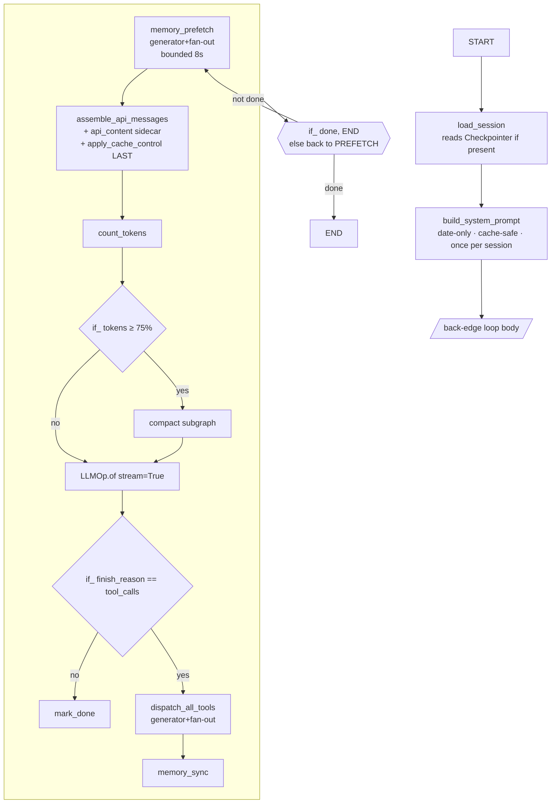

# Operonx → Agent Framework — Extension Plan (v2, post-1.0.0)

**Status:** rewrite of the pre-1.0.0 draft (preserved as
`AGENT_EXTENSION_PLAN.md.v1.bak`). This version composes on top of the
primitives that shipped in operonx 1.0.0 (2026-08-10): back-edge loops,
`PARENT.declare(reducers={...})`, `Checkpointer`, `InterruptOp`,
`engine.stream(mode=…)`, `LLMOp.of(fields=…, max_retries=…)`, filtered
observability via `@op(exclude=…, include=…, observe_max=…)`, and the
`operonx.reducers` module (`add_messages`, `dict_merge`).

**TL;DR** — 1.0.0 turned operonx into a real agent substrate. What v1 had
to build defensively (message accumulation, HITL branches, loop scaffolding,
retry supervisors, tracing filters) now ships in-framework. This plan adds
**one small package (`operonx/agents/`)**: a `@tool` decorator, a per-call
dispatch subgraph, a ReAct-loop factory, a sub-agent factory, and a handful
of pure-Python helpers. **~13 files, most under 200 LOC**, and the reference
harness (`operonx-code`) built on top. Nothing invents a "framework layer" —
we compose primitives already blessed by 1.0.0.

---

## 0 · State — read this first (11 Aug 2026)

**P0–P3 are complete, merged to `main`, and verified against a live
tool-calling model.** `main` is at `c328edb`. Nothing below is aspirational
unless it says so.

### 0.1 · What exists

```
operonx/agents/
├── tool.py            @tool + TOOL_REGISTRY + get_tool_definitions
├── policy.py          ToolPolicy — allow / ask / deny
├── redact.py          Redactor — credential scrubbing
├── memory.py          MemoryProvider ABC + LocalMarkdownMemory
├── skills.py          SKILL.md loading, matching, injection
├── session.py         AgentSession — multi-turn
├── graphs/
│   ├── dispatch.py    per-call subgraph: parse → route → approve → execute
│   ├── react.py       build_react_agent + agent_result
│   └── subagent.py    make_delegate_tool
└── ops/
    ├── model_ops.py   make_llm_caller — the LLMOp ↔ loop adapter
    ├── compact_ops.py plan_compaction / apply_compaction
    ├── memory_ops.py  gather_memory (+ the fan-out ops)
    └── prompt_ops.py  build_system_prompt / assemble / apply_cache_control
```

The loop, with the context stage wired in:

```
count_turn → last_user → plan → apply → memory → skills
           → assemble → cache_control → call_model → decide ─┬─▶ END
                    ▲                                        │
                    └──── gather ◀── dispatch ◀──────────────┘
```

**Tests:** 1593 unit (`-m "not integration"`), 5 live. 15 test files under
`tests/internal/agents/`, plus `tests/internal/core/ops/graph/test_loop_generator_backedge.py`
and `tests/internal/providers/test_llm_stream_tool_calls.py` for the first
two core fixes, and five more for §16 F2–F8:
`test_interrupt_default_target.py`, `test_trace_exclude.py`,
`test_stream_intermediate.py`, `test_bridge_filter.py`,
`test_parsing.py`.

### 0.2 · Running the live tests

Only `qwen3.7-plus` (on the siraya endpoint) was found to support tool
calling — the model id carries no `siraya/` prefix. The in-house
gemma endpoint does **not** — its vLLM runs without
`--enable-auto-tool-choice` and rejects `tool_choice="auto"`, so an agent
pointed at it never calls a tool and merely looks unhelpful.
`test_provider_supports_tool_calling` checks this first so the failure
reads as a server misconfiguration rather than an agent bug.

```bash
export OPERONX_TEST_LLM_URL=<siraya base url>     # from callbot .env: QWEN_API_URL
export OPERONX_TEST_LLM_KEY=<key>                 #                    QWEN_API_KEY
export OPERONX_TEST_LLM_MODEL=qwen3.7-plus
uv run pytest tests/internal/agents/test_live_agent.py -m integration
```

Credentials live in `/home/thanglq/educa-reminder-agent/.env`, which uses
` = ` spacing and therefore cannot be shell-sourced — parse it, don't
`source` it.

### 0.3 · What is NOT done

| | |
|---|---|
| **P4** | The out-of-tree `operonx-code` harness. No longer blocked: `stream(mode="updates")` now delivers a generator's yields as they land — see [Streaming](docs/architecture/streaming.md) |
| **P5** | Deferred: learning loop, MCP client, heartbeat scheduler |
| **Unverified primitives** | `EmitOp`/`stream(mode="custom")`, `SCRATCH`, sub-agent trace nesting — still 🟡 in the [archive](docs/design/AGENT_PLAN_ARCHIVE.md)'s §15.2 table |
| **C6** | No way to hand `LLMOp` a message list without prompt templating, so every agent must escape braces defensively |

### 0.4 · Where the rest of the context lives

This document is the **plan**: what is being built and why. Three other
places hold what came out of building it, and knowing which to open is
most of the value.

| Question | Read |
|---|---|
| How does operonx actually behave here? | [`docs/architecture/`](docs/architecture/) — contexts and cancellation in `execution-flow.md`, stream modes in `streaming.md`, `exclude=`/`observe_max` in `observability.md` |
| What mistakes does this codebase keep making? | [Failure modes](docs/architecture/failure-modes.md) — nine recurring shapes, each with the measurement that proved it |
| Is this plausible-sounding claim about operonx true? | [Archive](docs/design/AGENT_PLAN_ARCHIVE.md) — the full evidence trail, including three high-severity findings a probe **disproved** |
| What changed and when? | [CHANGELOG](CHANGELOG.md) |

**§14, §15 and §16 references throughout this document point into the
archive.** They were moved rather than deleted because the reasoning
outlives the conclusions.

The one line worth carrying without opening anything: **a passing test
proves the code does what you wrote, never that your assumption about the
dependency was right.** Four §2 rows below were wrong, not merely
unverified; four bugs hid behind scripted doubles until a live run; seven
more until adversarial review; one whole subsystem was built, tested and
wired to nothing.

---

## 1 · Why now (what 1.0.0 changed)

The pre-1.0.0 plan had to work around six missing primitives. All six shipped.
The table below is the load-bearing delta — every row erased a v1 workaround.

| Concern | v1 workaround | 1.0.0 primitive | Effect on this plan |
|---|---|---|---|
| Message accumulation across turns | Custom `append_messages` op with hand-written LangGraph-style id-upsert | `PARENT.declare(messages=[], reducers={"messages": add_messages})` | Delete custom merger. Turn output writes with `>> PARENT["messages"]`; framework merges. |
| Loop control | `with GraphOp.loop(name=…, until="expr", **initial_state) as loop:` | Back-edge inside `@graph` → Phase 3 synthesizes hidden `_GraphLoop`. `strict_dag=True` opts out. | ReAct loop is a plain `@graph` with `if_(done, END).else_(llm)`. No imperative scaffolding. |
| HITL / permission on destructive tools | Runtime `if_` branch reading a mode flag; hoped a human polled a queue somewhere | `InterruptOp(payload=…, timeout=…)` — emits `InterruptEvent` on state's bus, awaits `state._interrupt_responses[id]`. ~~`engine.stream()` auto-subscribes a listener; `handle.resume(id, value)` resolves.~~ 🔴 **that wiring does not exist — §15.1 V3** | `permission_gate` becomes a `Wait(InterruptOp) → if_ approve.else_ block` pattern. Real preempt, real resume. |
| Structured LLM output + retry | Separate ParserOp + custom retry loop in `ask()`; hallucinated a fallback trigger on parse errors | `LLMOp.of(fields=…, parser=…, validators=…, max_retries=…, retry_hint=True)` — inline parse + validate + Instructor-style error-guided retry on the same resource. Fallback narrowed to structural refusals only. | Router/classifier ops disappear into LLMOp calls with `fields=`. Retry taxonomy is honest: parse/validate → `max_retries`, refusal → `fallback`, transport → SDK. |
| Cross-turn state visibility / replay | Ad-hoc SCRATCH scraping | `Checkpointer` protocol + `InMemoryCheckpointer` — per-step delta store; `get_state(step)`, `get_updates(step)`, `list_steps()`. Zero overhead when unbound. | Sessions become "bind a checkpointer, replay the graph." Nothing custom in the agent layer. |
| Progress streaming to consumer | Peek into `ExecutionHandle._queue` | `engine.stream(mode="custom", channels=[…])` + `EmitOp` — fire-and-forget custom events with channel filtering. `mode="updates"` for per-op deltas; `mode="values"` for full-state snapshots (needs checkpointer). | Progress events are `emit(channel="tool_start", …)` — no framework changes. |
| Observability shaping | Hand-filtered per-op | `@op(exclude=…, include=…, observe_max=…)` — polymorphic list-or-dict; `ObserveBudgetExceeded` circuit-breaks runaway generators. | Prompt-cache defense, chunk-heavy streams, and tool-output truncation all shape at emission source. No tracer-side filter code. |

Two other cleanups that ripple through the plan:

- **`PARENT.shared(**vars)` was renamed to `PARENT.declare(**vars, reducers={…})`.** All the v1 shared-state examples get one line simpler and gain a merge policy.
- **`ask()` was removed.** `LLMOp.of(fields=…)` is the one canonical LLM shorthand. Nothing to teach twice.

**Net effect on scope:** v1 estimated 3–4 weeks compressed to 2–3. This
revision compresses further, to **~2 weeks for P0–P3**, because five of the
seven load-bearing scaffolds (message merge, loop, HITL, retry, streaming)
are framework code we no longer write.

---

## 2 · What operonx 1.0.0 primitives you compose on

These are the substrate. Every op-native construct in this plan resolves
back to one of these.

> **Read the [archive](docs/design/AGENT_PLAN_ARCHIVE.md)'s §15.2 before depending on a row.** This table was written from
> docstrings and design docs, not from running code. Two rows have been
> probed since; one was wrong. §15.2 tracks per-row verification status —
> probe the row when the phase that needs it starts, not all of them now.

| Concern | Primitive | Evidence |
|---|---|---|
| Turn loop | Back-edge inside `@graph` — Phase 3 build-time rewrite synthesizes `_GraphLoop`; `max_iterations=1000` default cap; `strict_dag=True` opts out | `graph_op.py` · `cycle_rewrite.py` · [docs/design/STATE_LOOP_REFACTOR_PLAN.md](docs/design/STATE_LOOP_REFACTOR_PLAN.md) |
| LLM streaming | `LLMOp.of(stream=True, …)` yields per token chunk; frames forwarded to `ExecutionHandle._queue` | `providers/ops/llm.py:_generate_core` · `engine.py:start` |
| Structured LLM output | `LLMOp.of(fields=[…], parser="json"\|"xml"\|"yaml", validators={…}, max_retries=N, retry_hint=True)` — parse + validate + semantic retry on same resource | `providers/ops/llm.py:_structured_generate` |
| Refusal vs parse failure | Structurally-detected `LLMRefusalError` (finish_reason ∈ {content_filter, safety} or non-empty `extras.refusal`) triggers `fallback=`; parse/validator failures use `max_retries` on the primary | `providers/ops/llm.py:_is_refusal` · MIGRATION.md §Runtime |
| Sub-agent isolation | Nested `@graph` — child ops live at deeper `ctx` tuple; parent refs hermetic (validated at build); nested trace spans auto-nest | `graph_op.py` · [docs/architecture/state-model.md](docs/architecture/state-model.md) |
| Shared cells + reducers | `PARENT.declare(**vars, reducers={var: fn(old,new)→merged})` — cell semantics + optional fan-in merge | `_edges.py:PARENTAccessor.declare` |
| Message accumulation | `operonx.reducers.add_messages` — LangGraph-compatible id-upsert + `RemoveMessage` / `REMOVE_ALL_MESSAGES` sentinels | `operonx/reducers.py` |
| Tool fan-out | Generator op yielding per tool call + `Ref.parallel(max=N)` on consumer | `ref.py:parallel` · `task_scheduler.py` |
| Ordered gather | `Ref.collect()` — buffered, flushed at EOF in yield-index order | `task_scheduler.py:_on_eof` · `ref.py:collect` |
| Preemptive cancel | `yield Interrupt(ctx_to_cancel=…)` from any op — scheduler drains pumps at that ctx prefix | `_events.py` · `task_scheduler.py` |
| **HITL suspend/resume** | **`InterruptOp(payload=…, timeout=…)` — emits `InterruptEvent`, awaits `state._interrupt_responses[id]`; outputs `response`, `timed_out`, `interrupt_id`.** 🔴 The op works, but the **engine is not wired to the bus** — see §15.1 V3 for the path that does work | `core/ops/flow/interrupt_op.py` |
| **Cross-run persistence** | **`Checkpointer` protocol + `InMemoryCheckpointer`.** 🔴 Bind at **`engine.start(inputs, checkpointer=…)`**, not `Operon(...)`; `get_state(step)` / `list_steps()` are on the **checkpointer**, not the handle — see §15.1 V11 | `checkpoint/base.py` · `checkpoint/memory.py` |
| **Custom progress events** | **`EmitOp(channel=…, payload=…)` + `engine.stream(mode="custom", channels=[…])` — fire-and-forget filterable event bus** | `core/ops/flow/emit_op.py` · `engine.py:stream` |
| **Observability shaping** | **`@op(exclude=[…], include=[…], observe_max=N)` — polymorphic filter at emission source; `ObserveBudgetExceeded` on runaway generators** | `core/ops/base.py` |
| Async I/O dispatch | `@op(bound="io"\|"cpu"\|"sync")` — auto thread-pool routing | `core/ops/base.py` |
| Config + secrets | `ResourceHub` — singleton, lazy, `resources.yaml`, `${VAR}` interpolation, 5-branch diagnostic errors | `core/registry/resource_hub.py` |
| Per-run scratchpad | `SCRATCH[key]` — free-form dict on `MemoryState._scratch`; mutations flow through the observer bus (Phase 2b3 B1) | `core/ops/_edges.py:ScratchAccessor` |

**You will build the agent by writing `@op`s and `@graph`s that plug into
this substrate. You will not re-implement any of the above.**

---

## 3 · The mental-model shift (unchanged from v1, sharper now)

Every "class" a hermes-style agent framework would demand either
**dissolves into an operonx primitive** or **shrinks to a thin
pure-Python helper**. 1.0.0 dissolves five more that v1 kept as ops.

| A hermes-style class | Op-native form | Notes |
|---|---|---|
| `TurnController` | Back-edge inside `@graph` — Phase 3 rewrite | v1 had `GraphOp.loop`; 1.0.0 collapses to DAG-native. |
| `LLMClient` | `LLMOp.of` | Simple + structured mode in one class. |
| `ToolDispatcher` | Subgraph (§7.2) | 5 ops + 2 branches per call. |
| `SubAgent` | Nested `@graph` (§7.4) | Free ctx isolation + trace nesting. |
| `Permission` engine | **`InterruptOp` → `if_(response.approved).else_(blocked)`** | v1 had a runtime branch on a stashed mode flag; 1.0.0 gives real HITL. |
| `MessageStore` / accumulator | **`PARENT.declare(messages=[], reducers={"messages": add_messages})`** | v1 wrote a custom merger op; framework ships one. |
| `SessionStore` | **`Checkpointer` binding** | v1 was a resource-registered SQLite class; 1.0.0 gives replay for free. |
| `ProgressStream` / eventer | **`EmitOp` + `engine.stream(mode="custom")`** | v1 sniffed the frame queue; 1.0.0 has a bus. |
| `RetrySupervisor` (parse errors) | **`LLMOp.of(max_retries=N, retry_hint=True)`** | v1 was a ~40-LOC ask() loop; 1.0.0 has Instructor-style semantic retry inline. |
| `Tracer` filter | **`@op(exclude=…, include=…, observe_max=…)`** | v1 filtered downstream; 1.0.0 filters at emission source. |
| `PromptAssembler` | `build_system_prompt` op | Pure fn wrapped in an op. |
| `Compactor` (algo) | `compact` subgraph + `if_` gate | Data-flow rewrite of messages. |
| `ToolRegistry` | Python dict `{name: op_factory}` | Built at import time. |
| `ErrorClassifier` | Pure function `(exc) → ErrorKind` + `if_` | No I/O, no state. |
| `MemoryProvider` ABC + backends | Classes in `ResourceHub`; methods wrapped as ops | Same. |
| `SkillLoader` (YAML parse) | Pure function at agent init | One-shot. |
| `Agent` composition root | ~30-LOC factory building the top-level `@graph` | Not a class. |

**Net effect:** the "12-module decomposition" from v1 collapses further. Ten
of the boxes above are now zero-LOC on our side — 1.0.0 handles them. What
remains is ~13 small files, most under 200 LOC.

---

## 4 · Module layout

```
operonx/agents/                    (NEW · blessed primitives · in-tree)
├── __init__.py                    # public surface: Tool, TOOL_REGISTRY, build_react_agent, subagent
├── CONTRIBUTING.md                # Footprint Ladder governance
│
├── tool.py                        # @tool decorator, TOOL_REGISTRY dict
├── errors.py                      # ClassifiedError + pure classify()
├── memory.py                      # MemoryProvider ABC + LocalMarkdownMemory
│
├── ops/
│   ├── memory_ops.py              # memory_prefetch (generator+fan-out), memory_sync, memory_write
│   ├── permission_ops.py          # request_approval (InterruptOp wrapper); permission_check (policy)
│   ├── compact_ops.py             # count_tokens, compact_messages
│   ├── prompt_ops.py              # build_system_prompt, apply_cache_control, assemble_api_messages
│   ├── skill_ops.py               # inject_skills_as_user_msg
│   └── progress_ops.py            # emit_progress helpers (thin EmitOp wrappers with typed payloads)
│
├── graphs/
│   ├── dispatch.py                # per-tool subgraph + all-tools fan-out
│   ├── react.py                   # ReAct back-edge loop factory
│   └── subagent.py                # sub-agent nested-@graph factory
│
└── skills/
    └── loader.py                  # SKILL.md YAML frontmatter parser
```

Also in tree:

```
operonx/cli/                        (renamed from operonx/tools/ — namespace fix)
```

Rename is still valid — `operonx/tools/` currently holds `operonx-pack`
(a Rust-spec serializer CLI). Freeing the `tools` name for agent tooling
avoids a permanent semantic clash.

**Done (P0, 1.2.0).** No back-compat shim: a shim would keep `tools`
occupied, which is the whole point of the move. The `operonx-pack`
console script is unchanged; only `from operonx.tools.pack import …`
breaks, and `scripts/regen_fixture.py` was its one in-repo consumer.

The rename surfaced a dead `operonx = "operonx.cli:main"` script entry,
carried since the April 2026 Hush→Operon migration and pointing at a
scaffolding CLI that the same migration deleted — `operonx --help` had
raised `ModuleNotFoundError` in every published release. **Removed
rather than implemented.** Operonx is a library; an umbrella dispatcher
with nothing to dispatch to fails criterion 3 of the op-worthy bar
(zero concrete demand) that this plan applies to everything else.
`tests/internal/cli/test_entry_points.py` now imports every declared
`[project.scripts]` target the way the generated wrapper does, so the
next dangling entry fails in CI instead of on a user's first install.

Out of tree (sibling PyPI package, iterates independently):

```
operonx-code/                       # reference coding-agent harness
```

---

## 5 · The agent as a graph — end-to-end shape



Every box is either an `@op` we write (~10–100 LOC each) or an existing
operonx op (`LLMOp`, `if_`, `EmitOp`, `InterruptOp`). No god-class. The
loop back-edge `BACK -->|not done| PREFETCH` is what the Phase 3 rewrite
turns into a synthesized `_GraphLoop` at build time.

---

## 6 · Design rules

### Rule 1 — Yield + fan-out beats imperative iteration

From operonx's own history: the classic `ForOp` / `MapOp` / `WhileOp`
classes were replaced by `yield` + downstream fan-out because it collapses
`for`, `map`, `while`, and *streaming* into a single primitive. **Never
write a `for` loop inside an op if you can yield instead.** A generator op
+ `Ref.parallel(max=N)` downstream gives you per-item concurrency, per-item
trace spans, per-item ctx isolation, and streaming-to-caller — all four for
free.

**Before** (imperative, hides parallelism, breaks streaming):

```python
@op
async def prefetch_all(query, providers):
    results = []
    for p in providers:
        results.append(await p.prefetch(query))   # sequential I/O
    return {"contexts": results}                  # batched result
```

**After** (yields, downstream fans out, streams naturally):

```python
@op
def each_provider(providers: list):
    for p in providers:
        yield {"provider": p}

@op
async def one_prefetch(query: str, provider):
    return {"context": await provider.prefetch(query)}

# In the graph:
gen    = each_provider(providers=PARENT["memory_providers"])
one    = one_prefetch(query=PARENT["query"], provider=gen["provider"].parallel(max=4))
merged = merge_contexts(items=one["context"].collect())   # ordered gather at EOF
```

Apply everywhere iteration is *independent* — tool dispatch (§7.2), memory
prefetch (§7.5), skill matching (§7.5), sub-agent fan-out (§7.5), LLM token
consumers (§7.5). The one place iteration is *dependent* is the outer ReAct
loop (turn N+1's LLM input depends on turn N's tool results) — that's what
back-edges are for.

### Rule 2 — Loops go through back-edges, never imperative wrappers

The v1 plan hedged that `GraphOp.loop` was the framework's "one imperative
primitive." 1.0.0 fixed that. **Every loop in the agent — outer ReAct,
inner retry, sub-agent turns — is a back-edge inside a `@graph`.** The
Phase 3 rewrite compiles it into a hidden `_GraphLoop` at build time; you
never touch the loop wrapper.

### Rule 3 — Reducers own accumulation, not custom ops

If a cell accumulates across turns (messages, cost, tool-call log), declare
it with a reducer:

```python
import operator
from operonx.reducers import add_messages, dict_merge

PARENT.declare(
    messages=[],
    cost_usd=0.0,
    tool_stats={},
    reducers={
        "messages": add_messages,      # LangGraph id-upsert + RemoveMessage sentinels
        "cost_usd": operator.add,
        "tool_stats": dict_merge,
    },
)
```

No `append_messages` op. No manual merge. Each turn's op writes with
`>> PARENT["messages"]`; the framework merges under a bounded lock.

### Rule 4 — Retry taxonomy is honest

Three failure modes, three primitives. Don't cross the streams.

| Failure mode | Symptom | Handler | Where |
|---|---|---|---|
| Transport | 429, 5xx, connection reset, timeout | SDK's own retry (litellm / openai / anthropic) | Under LLMOp, invisible |
| Parse / validate | JSON malformed, field missing, validator rejects | `LLMOp.of(max_retries=N, retry_hint=True)` — retries on **same resource** with the error injected into the next prompt | LLMOp inner loop |
| Refusal / content-filter | `finish_reason ∈ {content_filter, safety}` or non-empty `extras.refusal` | `LLMOp.of(fallback=[…])` — tries next model | LLMOp fallback chain |
| Semantic ("bad" answer that parsed fine) | Answer is correctly formed but wrong for the task | Agent-level: another loop iteration or self-critique | ReAct loop body |

**No transport-retry knob on LLMOp** — the SDK is battle-tested. A wrapping
retry would just double the exponential backoff.

---

## 7 · Core sketches

### 7.1 · `@tool` — a tool IS an `@op` with metadata

```python
# operonx/agents/tool.py
from operonx import op

TOOL_REGISTRY: dict[str, callable] = {}

def tool(
    *, name, description, schema,
    readonly=False, concurrency_safe=False, destructive=False,
    check_fn=None, max_result_chars=100_000, dynamic_schema_overrides=None,
):
    """Register a function as both an @op and an LLM-callable tool.

    The op_factory returned is the *same object* stored in TOOL_REGISTRY —
    dispatch calls `.core(**args)` to reuse the op's own execution path
    (free tracing, timing, cancellation, bound routing).
    """
    def wrap(fn):
        fn._tool_meta = dict(
            name=name, description=description, schema=schema,
            readonly=readonly, concurrency_safe=concurrency_safe,
            destructive=destructive, check_fn=check_fn,
            max_result_chars=max_result_chars,
            dynamic_schema_overrides=dynamic_schema_overrides,
        )
        op_factory = op(fn)                # reuse operonx @op
        TOOL_REGISTRY[name] = op_factory
        return op_factory
    return wrap

@tool(
    name="edit",
    description="str_replace edit",
    schema={...},
    destructive=True,                     # → triggers HITL approval in dispatch
)
async def edit_tool(path: str, old: str, new: str):
    ...
    return {"result": diff}
```

**Two schemas per tool are unavoidable:**

- operonx `Param` — signature-parsed, drives `>>` wiring at build time
- LLM JSON Schema — hand-authored, drives the model's `tools=[…]` payload

Keep them side-by-side per tool. Wrap common patterns (`ExtractField`-style
mini-DSL for the JSON Schema) in helpers if the pain grows.

### 7.2 · Tool dispatch — shipped shape

> **Built.** `operonx/agents/graphs/dispatch.py`. The sketch this replaces
> had three defects (§15.1 V1, V2, V5); what follows is what runs.

```
parse ─▶ route ─▶ approve (InterruptOp) ─▶ normalize ─┐
             └──▶ auto_ok ───────────────────────────┴─▶ execute
```

Four ops and one branch per call — fewer than the sketch, because the two
approval arms converge on a single `execute` through `PARENT["decision"]`
instead of each carrying its own copy of the execution path.

**Every call returns exactly one tool message.** Providers reject a
conversation in which an assistant `tool_call` has no matching result, so
unknown tool, unparseable arguments, an exception inside the tool, a
timeout and a human denial all come back as messages the model can act
on. `execute` catches everything *itself* — operonx records op errors
into state and returns a partial result rather than raising, so an
uncaught error would emit no message at all and surface a turn later as
a provider 400.

**`parse_call` assembles the approval payload** and hands `InterruptOp` a
single bare ref. A Ref nested in a dict is rejected at construction now;
before that check existed, the human approving a destructive call was
shown `Ref` objects instead of the tool name and arguments.

**`normalize_decision` keeps expiry distinct from refusal.** `InterruptOp`
reports a timeout on a separate output; writing only `response` made "no
one answered" indistinguishable from "a human said no", and the model was
told it had been declined.

`execute`'s parameter is `tool_name`, not `name` — `name` is in
`_BASE_INIT_KEYS` and operonx warns it may be read as an op constructor
argument rather than an input.

### 7.3 · ReAct loop — shipped shape

> **Built.** `operonx/agents/graphs/react.py`. The v2 sketch did not
> compile: `@graph(max_iterations=…)` does not exist. Running it produced
> §15.1 V7–V10.

```
START ─▶ seed ─▶ count_turn ─▶ call_model ─▶ decide ─┬─▶ END
                     ▲                                │
                     └── gather ◀── dispatch ◀────────┘
```

`call_model` is **injected**, not constructed here — the loop is testable
without a provider and callers choose their own `LLMOp.of(...)`.

**The turn budget lives in the agent layer, not the graph.** A
graph-level cap cuts mid-flight, tells the model nothing, and leaves
partial state. `count_turn` injects a notice at the limit and lets the
model take one final turn, so exhaustion exits the way success does.
Keeping it out of `call_model` matters too: a budget the caller could
forget to implement is not a budget.

**`decide` folds the three exit conditions** — model finished, budget
spent, no tools requested — into one boolean, so the branch stays a
Ref-vs-literal comparison, the only form `if_` evaluates correctly.

**There is no terminal `finish` op.** An op wired after a loop that
contains a generator never becomes ready and is skipped silently (V9), so
`agent_result(result, agent)` reads the merged cells directly. That is
also why it takes the graph.

**`gather_tool_messages` exists because `collect()` hands over a single
message dict per call** while `add_messages` requires lists on both
sides. Writing raw frames raised inside the reducer, and since operonx
records op errors rather than propagating them, the run ended quietly
with a partial conversation.

### 7.4 · Sub-agent = nested `@graph`

```python
# operonx/agents/graphs/subagent.py
from operonx import op, graph, PARENT, START, END
from operonx.reducers import add_messages
import operator

DELEGATE_BLOCKED_TOOLS = frozenset(["delegate", "memory", "clarify", "send_message"])

@graph
def subagent(task: str, *, parent_tools: dict, max_iterations: int = 10):
    """Nested agent — its own loop, own state, restricted toolset.

    - Nested ctx tuple auto-isolates state.
    - Nested @graph auto-nests trace spans (V3 tracing).
    - Cost + final message bubble up via explicit `>> PARENT[…]` writes.
    - No sub-sub-delegation by default (blocklist enforced at construction).
    - Cancellation propagates automatically: parent `yield Interrupt(ctx_to_cancel=…)`
      drains all child ops at once.
    """
    child_tools = {n: t for n, t in parent_tools.items()
                   if n not in DELEGATE_BLOCKED_TOOLS}

    # Sub-agent's own accumulator — reducers apply within this nested scope.
    PARENT.declare(
        cost_usd=0.0,
        final_message="",
        reducers={"cost_usd": operator.add},
    )

    react = build_react_agent(
        model="claude-haiku-4-5",           # cheaper for sub-tasks
        tool_schemas=[t._tool_meta["schema"] for t in child_tools.values()],
        max_iterations=max_iterations,
    )()

    # Inject the parent task as the initial user message.
    react["messages"] >> PARENT["messages"]      # simplified; wrap task in a user-role msg

    react["cost_usd"]      >> PARENT["cost_usd"]
    react["final_message"] >> PARENT["final_message"]
    START >> react >> END
```

No HMAC capability tokens at v1 — enforce tool-subset at construction site.
If we ship a plugin surface in v2, add the HMAC layer then.

### 7.5 · Where the yield + fan-out pattern reappears

Four places where an imperative op would be a mistake. Same pattern, same
free wins (per-item concurrency, spans, ctx, streaming).

**Memory prefetch across N providers** — bounded 8s deadline as `.parallel(max=N, timeout=8.0)`:

```python
@op
def each_provider(providers: list):
    for p in providers:
        yield {"provider": p}

gen = each_provider(providers=PARENT["memory_providers"])
one = provider_prefetch(query=PARENT["query"], provider=gen["provider"].parallel(max=4))
ctx = merge_contexts(items=one["context"].collect())   # <memory-context>…</memory-context>
```

**Skill matching + injection** — each matching skill yields; downstream renders in parallel; ordered `collect()` concatenates:

```python
@op
def each_matching_skill(query: str, skills: list):
    for s in skills:
        if s.matches(query):
            yield {"skill": s}

gen      = each_matching_skill(query=PARENT["query"], skills=PARENT["skills"])
rendered = render_skill(skill=gen["skill"].parallel(max=8))
user_msg = concat_as_user_msg(items=rendered["text"].collect())    # per hermes cache trick
```

**Sub-agent orchestration (parallel sub-tasks)** — parent yields tasks, subagent graph invoked per yield in parallel, results gather in order:

```python
@op
def each_subtask(plan: dict):
    for task in plan["subtasks"]:
        yield {"task": task}

gen  = each_subtask(plan=orchestrator["plan"])
subs = subagent(task=gen["task"].parallel(max=3), parent_tools=PARENT["tools"])
merged = merge_subagent_results(items=subs["final_message"].collect(),
                                costs=subs["cost_usd"].collect())
```

**LLM stream → multiple downstream consumers** — `LLMOp.of(stream=True)` yields per token chunk; fan-out means each consumer sees every chunk in parallel:

```python
llm       = LLMOp.of(resource="claude-sonnet", stream=True, prompt=..., tools=...)
moderator = check_content(chunk=llm["content"].parallel(max=1))     # sequential guard
display   = stream_to_stdout(chunk=llm["content"].parallel(max=1))
storage   = append_to_session(chunk=llm["content"].parallel(max=1))
assembler = accumulate_tool_calls(delta=llm["tool_calls"].collect())  # buffered until EOF
```

Every case above would have been a `for` loop + `asyncio.gather` in a
hermes-style codebase. Here it's a generator + `.parallel()` — same intent,
less to maintain, streaming for free.

---

## 8 · Load-bearing invariants

These are hard invariants stolen from hermes's ~3000 LOC of prompt-cache
defense and tool-safety logic. They now live inside specific ops, not
scattered across a god-class.

### 8.1 · Prompt cache — invariants in `prompt_ops.py`

| # | Invariant | Where enforced |
|---|-----------|----------------|
| 1 | System prompt is **date-only**, never minute-precision | `build_system_prompt` op |
| 2 | System prompt built ONCE per session, cached, replayed verbatim | `PARENT.declare(system_prompt=None)` — set once by `build_system_prompt`, read every turn |
| 3 | `api_content` sidecar = exact bytes previously sent → byte-stable retries | Stored in checkpointer state via `save_turn` op |
| 4 | Whitespace strip BEFORE `apply_cache_control` (marker rewrites str→list) | Ordered inside `assemble_api_messages` op |
| 5 | 4 breakpoints TTL-shared (5m/1h): static prefix + system tail + last 2 msgs | `apply_cache_control` helper (pure fn) |
| 6 | Plugin hooks inject into USER msg, NEVER system | `inject_skills_as_user_msg` op |
| 7 | Ephemeral system prompt APPENDED after cached string | `assemble_api_messages` op |
| 8 | OpenRouter: `role:tool` + top-level `cache_control` → silent hang | Special-case in `apply_cache_control` |

Ship a first-class metric: `cache_hit_rate = cache_read_tokens / (cache_read + cache_write)`
— thread through V3 tracing via `EmitOp(channel="cache_metrics", …)`. Hermes has the raw
sums but not the ratio; we do better.

### 8.2 · Compaction — 75% threshold, proactive + reactive, anti-thrash

Lives in `compact_ops.py` + gated by an `if_` branch in the ReAct loop.
No `Compactor` class — just:

- `count_tokens` op (pure, ~10 LOC)
- `compact_messages` op — inside it, an `LLMOp.of(fields=[…], parser="json")` summarizes, then re-injects the sentinels
- Anti-thrash state via `PARENT.declare(last_compact_iter=-999)`; branch reads iteration delta from the synthesized loop's iter counter

Sentinels stolen verbatim from hermes:

- End marker: `--- END OF CONTEXT SUMMARY — respond to the message below, not the summary above ---`
- Skill re-injection: `[SKILL_PRUNED: content lost in compression; reload with skill_view(name='X')]`
- Continuation sentinel when compacted window has no user turn
- Summary prefix MUST include `"tools remain fully active — keep calling them normally"` + `"MEMORY.md is still authoritative"`

### 8.3 · Error handling — pure `errors.py` + `if_` branches

```python
# operonx/agents/errors.py
@dataclass(frozen=True)
class ClassifiedError:
    reason: str            # "timeout" | "rate_limit" | "context_overflow" | "auth" | ...
    retryable: bool
    should_compress: bool
    should_rotate_credential: bool
    should_fallback: bool

def classify(exc: Exception) -> ClassifiedError:
    """Pure function. Start with 6 reasons; add as we hit them (Footprint Ladder)."""
    ...
```

Consumed by an `error_classifier` op that reads `llm["error"]` (operonx
already captures errors into `state[op, "error", ctx]`) and routes via `if_`.
**Parse errors don't reach this classifier** — they're absorbed by
`LLMOp.of(max_retries=N)` inside the LLM call. Refusals don't reach it
either — they trigger `fallback=` structurally. What's left here is
context overflow, auth failure, rate-limit exhaustion after SDK's own
retries — genuine failure modes.

### 8.4 · HITL for destructive tools — invariants in `permission_ops.py`

New in v2 — 1.0.0 makes this a real primitive.

| # | Invariant | Where enforced |
|---|-----------|----------------|
| 1 | Every destructive tool call requires human approval by default | `dispatch_one` — `is_destructive` gate → `InterruptOp` |
| 2 | Approval decision is per-call, never batched (else one "yes" approves N deletes) | `dispatch_one` runs per call; each call gets its own InterruptOp |
| 3 | Timeout defaults to 5 minutes; on timeout the call is auto-declined | `InterruptOp(timeout=300.0)` + `timed_out` output routes to `blocked_result` |
| 4 | Rejection produces a `role:tool` message the LLM sees ("blocked: denied by human") | `blocked_result` op |
| 5 | Rejection does not tear down the turn; agent continues with the block message | Back-edge continues to next iteration; the block message accumulates via `add_messages` |
| 6 | Approval mode can be pre-authorized session-wide (`--yes-mode`) — bypasses InterruptOp via a policy op that short-circuits before dispatch | `permission_check` op reads a session flag from `PARENT["approval_mode"]` |
| 7 | Approval events are recorded in the checkpointer as `InterruptEvent`s → resume-safe | Framework — the InterruptOp fires `state._notify_interrupt(…)` |

---

## 9 · Phase roadmap

Compressed further vs v1 because five load-bearing scaffolds landed in 1.0.0.

```
Week 1   P0  P1                Tools + ReAct + HITL
Week 2       P2                Memory + compaction + cache invariants
Week 3            P3           Sub-agents + skills + policy modes
Week 4                 P4      Reference harness (operonx-code)
Later                       P5 Learning-loop pattern doc (defer)
```

| # | Phase | Deliverable | Size |
|---|-------|-------------|------|
| **0** ✅ | Namespace + governance | Rename `operonx/tools/` → `operonx/cli/`; scaffold `operonx/agents/`; write Footprint Ladder into `CONTRIBUTING.md` | 0.5d |
| **1** ✅ | Tool + ReAct + HITL | `@tool` + `TOOL_REGISTRY`; `dispatch_one`/`dispatch_all_tools` graphs (incl. destructive→InterruptOp branch); `build_react_agent` back-edge factory; `permission_check` op; rewrite `docs/guide/05-agents.md` example (should be ~25 lines) — **plus §14.3 rows 1–6**: tool-error→tool-message, unknown-tool handling, history invariant, concurrent-HITL gate, repeat cap, state injection, and the `wrap_*` closure fold (§14.2) | 5–7d |
| **2** ✅ | Context lifecycle | `MemoryProvider` ABC + `LocalMarkdownMemory`; `memory_prefetch/sync` ops (generator+fan-out); prompt-cache invariants in `prompt_ops.py`; sessions via `Checkpointer` binding (no custom SessionStore). **Compaction is a subsystem, not one op** (§14.3) — trigger policy, what to summarise, what to drop, what to keep verbatim | 5–7d |
| **3** ✅ | Safety + sub-agents + skills | Policy modes for `permission_check` (deny / ask / allow); **redaction at the same trust boundary** (§14.3); `subagent` `@graph` factory + delegate blocklist; `SkillLoader` + `inject_skills_as_user_msg` op; YAML prompt-file loader | 4–5d |
| **4** ⬜ | Reference harness | Sibling `operonx-code` package — bash/read/edit/patch/glob/grep/webfetch tools, persistent shell resource, CLI entrypoint | 5–7d |
| **5** ⬜ | Deferred | Learning-loop pattern doc (LLM-writes-SKILL.md fork) · MCP client · Heartbeat scheduler | — |

**Estimate**: **P0–P3 in ~3 weeks**, P4 in another week.

Revised upward from ~2 weeks after the §14 audit. The loop estimate was
right; the tool-execution and context-lifecycle estimates were not.
LangChain spends ~9,400 LOC on middleware against ~2,000 on the loop, and
this plan had the ratio inverted. We still come out far below both
references — 1.0.0 shipped the substrate (reducers, back-edges,
checkpointer, HITL, structured LLMOp) that v1 and langgraph both had to
build — but "the agent is just a loop" was the wrong lesson to draw from
that.

---

## 10 · Honest gaps (v1 gap #7 resolved; new gaps identified)

> **See also §14** — a cross-implementation audit against hermes-agent,
> langgraph and langchain (11 Aug 2026) found nine further gaps, six of
> which belong in P1. The list below predates it.

The op-native form is elegant but not lossless. Six real gaps remain.

1. **Two schemas per tool** — operonx `Param` (build-time wiring) vs LLM
   JSON Schema (runtime payload). Duplication is inherent to the two
   consumers. Keep them side-by-side per tool; wrap common patterns in
   helpers.

2. **HITL requires a caller loop** — `InterruptOp` is a real primitive,
   but the caller (CLI, HTTP server, whatever) must `async for event in
   engine.stream(mode="custom")`, filter for `InterruptEvent`, prompt the
   human, and call `handle.resume(id, {"approved": …})`. That's a
   ~30-LOC harness per surface (CLI, TUI, HTTP). Not framework work —
   integration work.

3. **`SCRATCH` reads require an `@op`** — branch conditions eval on state
   cells, not scratch dict. For cross-iteration state read from a branch,
   use a `PARENT.declare(x=…)` cell instead. (Unchanged from v1; still
   annoying.)

4. **HMAC capability tokens have no operonx equivalent** — enforce
   sub-agent tool-subset at graph construction site. Add HMAC in v2 only
   if we ship a plugin surface.

5. **Backpressure** — `ExecutionHandle._queue` is unbounded. Fine for
   typical sessions; long token-heavy sessions with a slow CLI consumer
   could exhaust memory. Would need an operonx-core change
   (`asyncio.Queue(maxsize=N)`). Defer to a later operonx release unless
   we hit it.

6. **Adaptive turn budget** — the synthesized loop's `max_iterations` is
   static. A hermes-style budget that shrinks on tool-error rate needs
   the loop's back-edge branch to read runtime state
   (`PARENT["turn_stats"]`) via an `@op`. Doable without framework
   changes; just an idiom to document.

**Resolved from v1:** the "GraphOp.loop is the one imperative-feeling
primitive" complaint (v1 gap #7) is gone. Back-edge loops in 1.0.0 are
DAG-native. The `@fold` decorator wish is moot.

---

## 11 · Steal / Reject — abbreviated

Same list as v1 (28 steals × 20 rejects). The delta is that hermes-derived
patterns steal *conceptually* now — we don't inherit any of hermes's
plumbing. We steal the `_check_fn` TTL-cache algorithm; we don't steal the
~7k-LOC god-class it lives in. We steal the `apply_cache_control`
invariants; we don't steal the 60-parameter `__init__`. We steal the
tool-block message contract (`role:tool` with `"blocked: reason"`); we
don't steal the polling loop.

The biggest reject remains **hermes's decision to make `AIAgent` a class
at all**. That is what forced the 60-param init, the ~600 callbacks, the
fat forwarder shims, the "Phase 1 step 4 in progress" perpetual refactor.
Operonx's `@op`/`@graph` model **structurally prevents** that failure mode
— you cannot god-class your way out of a DAG.

---

## 12 · Governance — the Footprint Ladder

Unchanged from v1. Adopt on day 1 in `operonx/agents/CONTRIBUTING.md`.

```
 6. core          ██████  ← reserve for absolute universals
 5. MCP           █████
 4. plugin        ████
 3. gated tool    ███
 2. CLI + skill   ██
 1. extend op     █       ← START HERE
```

Every PR adding a `core` primitive must justify why rungs 1–5 don't work.

---

## 13 · First concrete step

1. **P0 · half-day** — rename `operonx/tools/` → `operonx/cli/` (single-file
   change: `pack.py` + one `pyproject.toml` entry). Scaffold `operonx/agents/`
   per §4. Add `CONTRIBUTING.md` with Footprint Ladder.

2. **1-page ADR before P1 code** — cover:
   - `@tool` decorator: metadata carrier only (op factory reused via `@op`).
   - `TOOL_REGISTRY` shape: `dict[str, op_factory]`, populated at import time.
   - `dispatch_one` subgraph shape: 5 ops + 2 branches + optional InterruptOp
     for destructive (see §7.2).
   - Two-schema reality: operonx `Param` for wiring vs LLM JSON Schema for
     payload.
   - Where `check_fn` TTL + failure-grace lives (pure Python helper called
     at `get_tool_definitions()` build time).
   - **New in v2:** HITL harness contract (what CLI/HTTP callers must do
     to respond to `InterruptEvent`).
   - **New (§14):** where the `wrap_*` closure fold lives, and why it is
     not a graph feature.
   - **New (§14):** the tool-failure contract — every failure mode
     (raise, timeout, cancel, unknown name, denial) produces a tool
     message, so the history invariant holds and the model can recover.
   - **New (§14):** how concurrent `InterruptOp`s are serialised under
     `.parallel()` fan-out.
   - **New (§14.5):** in-tree `operonx/agents/` vs a sibling package —
     answer it, don't assume it. LangGraph reversed this exact call.

   Two things to **verify before writing `dispatch.py`**, because both
   change its shape:
   - Can two branch arms converge on a single node, or does each arm need
     its own instance (as §7.2 currently assumes)? Nothing in
     `tests/internal/core/ops/flow/` establishes this.
   - Does an `InterruptOp` inside a `.parallel()` fan-out suspend only its
     own arm, or the whole pump?

3. **Then P1 — build in this order:**
   1. `@tool` + `TOOL_REGISTRY` (`operonx/agents/tool.py`)
   2. `dispatch_one` + `dispatch_all_tools` (`operonx/agents/graphs/dispatch.py`)
   3. `permission_check` op (`operonx/agents/ops/permission_ops.py`)
   4. `build_react_agent` factory (`operonx/agents/graphs/react.py`)
   5. Rewrite `docs/guide/05-agents.md` example — should be ~25 lines using the new factory
   6. Minimal HITL CLI harness in `examples/python/ex09_agent_workflow/` — reads InterruptEvents, prompts, calls `handle.resume`

Everything after P1 compounds on these six.

---
## 14 · Audit, ledger and findings — archived

The cross-implementation audit (§14), the verification ledger (§15) and
the adversarial-review findings (§16) moved to
[`docs/design/AGENT_PLAN_ARCHIVE.md`](docs/design/AGENT_PLAN_ARCHIVE.md).
All of it is resolved history: **F1–F8 are fixed** and described in the
[CHANGELOG](CHANGELOG.md), and **A1–A7** were fixed as they were found.

Two pointers instead of the 400 lines:

- **The rules that came out of it** — [Architecture → Failure
  modes](docs/architecture/failure-modes.md). Nine recurring shapes, each
  with the measurement that proved it. Read this one.
- **The evidence trail** — the archive, including §16.2, the three
  high-severity findings that a probe disproved. Read this when a
  plausible-sounding claim about operonx needs checking before you act on
  it.

The mechanics those findings established now live where they are used:
[Execution flow](docs/architecture/execution-flow.md) (contexts,
cancellation), [Streaming](docs/architecture/streaming.md) (which stream
mode sees which ops), and [Observability](docs/architecture/observability.md)
(`exclude=`/`include=`, `observe_max`).
