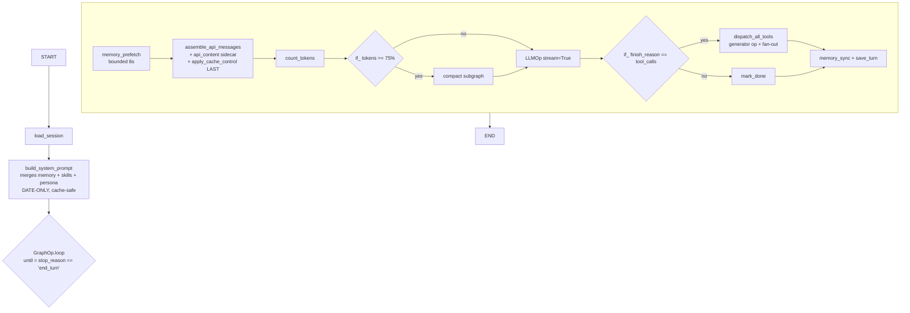

# Operonx → Agent Framework — Extension Plan (op-native)

**TL;DR** — Operonx already gives you 70% of what an agent framework needs: `GraphOp.loop` = ReAct loop, `LLMOp(stream=True)` = streaming LLM, nested `@graph` = sub-agent with isolated state, `ResourceHub` = pluggable backends, `Ref.parallel()` / `.collect()` = tool fan-out with ordered gather, `Interrupt` yield = preemptive cancellation, V3 tracing = automatic span nesting. Add **~4 pure-Python modules + ~8 op/graph factories + 1 composition root** and you have a real agent framework. Everything else that hermes-agent grew (60-param god-init, 7k-LOC turn controller, class-per-concern architecture) is a symptom of not having a DAG substrate.

---

## 1 · The mental-model shift

Every "class" I proposed in v1 either **dissolves into an operonx primitive** or **shrinks to a thin pure-Python helper**. Nothing to invent; almost everything to compose.

| v1 draft (hermes-style class) | Op-native form | Why |
|---|---|---|
| `TurnController` | **dissolves → `GraphOp.loop(until=...)`** | Loops are a primitive |
| `LLMClient` | **dissolves → `LLMOp`** | Already exists |
| `ToolDispatcher` | **dissolves → subgraph** | Per-call dispatch is a graph of 4-6 ops |
| `SubAgent` | **dissolves → nested `@graph`** | Nested `ctx` tuple isolates state automatically |
| `Permission` engine | **dissolves → `permission_gate` op + `if_` branch** | Routing decision on runtime data |
| `PromptAssembler` | **dissolves → `build_system_prompt` op** | Pure function wrapped in an op |
| `Compactor` (the algo) | **dissolves → `compact` subgraph + `if_` gate** | Data-flow rewrite of messages |
| Streaming plumbing | **dissolves → `LLMOp(stream=True)` + `ExecutionHandle`** | Frame-per-yield already works |
| `ToolRegistry` | thin Python dict `{name: op_factory}` | Built at import time |
| `ErrorClassifier` | thin pure function `(exc) → ErrorKind` | No I/O, no state |
| `SessionStore` (storage) | class in `ResourceHub`; methods wrapped as ops | Lifecycle = resource; call-sites = ops |
| `MemoryProvider` ABC + backends | classes in `ResourceHub`; methods wrapped as ops | Same |
| `SkillLoader` (YAML parse) | pure function at agent init | One-shot |
| `Agent` composition root | ~50-LOC factory function that builds the top-level `GraphOp` | Not a class |

**Net effect:** the "12-module decomposition" from v1 collapses to **~13 small files** — 4 pure-Python + 8 op factories + 1 composition root. Most under 200 LOC.

---

## 2 · What Operonx already gives you

These aren't things to build. They're primitives to **compose**.

| Concern | Operonx primitive | Evidence |
|---|---|---|
| Turn loop | `GraphOp.loop(until="expr", **state)` — state feedback via `>> PARENT["k"]`, `max_iterations` cap | `graph_op.py:130-163` · `task_scheduler.py:103-106` |
| LLM streaming | `LLMOp(stream=True)` — token-per-frame, forwarded to `ExecutionHandle._queue` | `llm.py:406-427` · `engine.py:143-154` |
| Sub-agent isolation | Nested `GraphOp` — child ops live at deeper `ctx` tuple; parent refs are hermetic (validated at build) | `graph_op.py:414-445` · [state-model.md:19](../../Operon/docs/architecture/state-model.md#L19) |
| Trace-span nesting | V3 auto-record — every op invocation is one `OpExecution` with `op_id` + `ctx`; nested graphs auto-nest | `base.py:746-992` · `workflow_trace.py:1-100` |
| Tool fan-out | Generator op yielding per tool call + `Ref.parallel(max=N)` on consumer | `ref.py:155-172` · [streaming.md:29-39](../../Operon/docs/architecture/streaming.md#L29) |
| Ordered gather | `Ref.collect()` — buffered, flushed at EOF in yield-index order | `task_scheduler.py:346-361` |
| Preemptive cancel | `yield Interrupt(ctx_to_cancel=...)` — scheduler drains queue + cancels pumps at that ctx prefix | `_events.py:38-64` · `task_scheduler.py:395-499` |
| Async I/O dispatch | `@op(bound="io" \| "cpu" \| "sync")` — auto thread-pool routing | `base.py:657` `,669-683` |
| Config + secrets | `ResourceHub` — singleton, lazy, `resources.yaml` + `${VAR}`, 5-branch diagnostic errors | `resource_hub.py:34,267-321` |
| Retry | `@graph` factories accept `until="error == None"` + `max_iterations` — see `ask()` retry mode | `providers/ops/ask.py` |
| Shared session vars | `PARENT.shared(x=...)` — single cell across all stream contexts | `_edges.py:58-78` |
| Per-run scratchpad | `SCRATCH[key]` — free-form dict on `MemoryState._scratch` | `_edges.py:172-217` |

You will build the agent by writing `@op`s and `@graph`s that plug into this substrate. You will not re-implement any of the above.

---

## 3 · Where we're going — module layout

```
operonx/agents/                    (NEW · blessed primitives · in-tree)
├── __init__.py                    # public surface
├── CONTRIBUTING.md                # Footprint Ladder governance
│
├── tool.py                        # @tool decorator, ToolRegistry dict
├── errors.py                      # ClassifiedError + pure classify()
├── session.py                     # SessionStore class (ResourceHub-registered)
├── memory.py                      # MemoryProvider ABC + LocalMarkdownMemory
│
├── ops/                           # thin op wrappers around the above
│   ├── memory_ops.py              # memory_prefetch, memory_sync, memory_write
│   ├── session_ops.py             # load_session, save_turn
│   ├── permission_ops.py          # permission_gate (+ TLS approval ContextVar)
│   ├── compact_ops.py             # count_tokens, compact_messages
│   ├── prompt_ops.py              # build_system_prompt, apply_cache_control
│   └── skill_ops.py               # inject_skills_as_user_msg
│
├── graphs/                        # graph factories
│   ├── dispatch.py                # per-tool + all-tools dispatch subgraphs
│   ├── react.py                   # ReAct GraphOp.loop factory
│   └── subagent.py                # subagent nested-@graph factory
│
└── skills/
    └── loader.py                  # SKILL.md YAML frontmatter parser
```

Also in tree:
```
operonx/cli/                        (renamed from operonx/tools/ — namespace fix)
```

Out of tree (sibling PyPI package, iterates independently):
```
operonx-code/                       # reference coding-agent harness
```

---

## 4 · The agent as a graph — end-to-end shape



Every box is either an `@op` we write (~10-100 LOC each) or an existing operonx op (`LLMOp`, `if_`, `GraphOp.loop`). No god-class.

---

## 5 · Core sketches (and the one design rule that shapes them)

**Design rule** — from operonx's own history. The classic `ForOp` / `MapOp` / `WhileOp` classes were replaced by `yield` + downstream fan-out because it collapses `for`, `map`, `while`, and *streaming* into a single primitive. **Never write a `for` loop inside an op if you can yield instead.** A generator op + `Ref.parallel(max=N)` downstream gives you per-item concurrency, per-item trace spans, per-item ctx isolation, and streaming-to-caller — all four for free.

**Before** (imperative, hides parallelism, breaks streaming):
```python
@op
async def prefetch_all(query, providers):
    results = []
    for p in providers:
        results.append(await p.prefetch(query))     # sequential I/O
    return {"contexts": results}                    # batched result
```

**After** (yields, downstream fans out, streams naturally):
```python
@op
def each_provider(providers: list):
    for p in providers:
        yield {"provider": p}

@op
async def one_prefetch(query: str, provider):
    return {"context": await provider.prefetch(query)}

# In the graph:
gen  = each_provider(providers=PARENT["memory_providers"])
one  = one_prefetch(query=PARENT["query"], provider=gen["provider"].parallel(max=4))
merged = merge_contexts(items=one["context"].collect())      # ordered gather at EOF
```

Same intent, different taste. The generator version fans out in parallel automatically; the imperative version does I/O sequentially. **Apply this rule everywhere** — tool dispatch (§5.2), memory prefetch across N providers (§5.5), skill matching + injection (§5.5), sub-agent fan-out (§5.5), LLM token consumers (§5.5).

The one exception is §5.3 (the outer ReAct loop) where iteration is *genuinely dependent* — turn N+1's LLM input depends on turn N's tool results. That's the honest limit of the pattern; see §8.7.

### 5.1 · `@tool` — a tool IS an `@op` with metadata

```python
# operonx/agents/tool.py
from operonx import op

TOOL_REGISTRY: dict[str, callable] = {}

def tool(*, name, description, schema,
         readonly=False, concurrency_safe=False, destructive=False,
         check_fn=None, max_result_chars=100_000, dynamic_schema_overrides=None):
    """Register a function as both an @op and an LLM-callable tool."""
    def wrap(fn):
        fn._tool_meta = dict(
            name=name, description=description, schema=schema,
            readonly=readonly, concurrency_safe=concurrency_safe,
            destructive=destructive, check_fn=check_fn,
            max_result_chars=max_result_chars,
            dynamic_schema_overrides=dynamic_schema_overrides,
        )
        op_factory = op(fn)                # reuse operonx @op — free tracing, timing, cancel
        TOOL_REGISTRY[name] = op_factory
        return op_factory
    return wrap

@tool(name="edit", description="str_replace edit", schema={...}, destructive=True)
async def edit_tool(path: str, old: str, new: str):
    ...
    return {"result": diff}
```

Two schemas coexist by necessity:
- **operonx `Param`** — signature-parsed, drives `>>` wiring at build time
- **LLM JSON Schema** — hand-authored, drives the model's `tools=[...]` payload

That duplication is real; no elegant escape. Keep them side-by-side per tool.

### 5.2 · `dispatch_all_tools` — per-call subgraph + generator-op fan-out

```python
# operonx/agents/graphs/dispatch.py
from operonx import op, graph, GraphOp, START, END, PARENT
from operonx.core.ops.flow import if_
from operonx.agents.tool import TOOL_REGISTRY
from operonx.agents.ops.permission_ops import permission_gate

@op
def each_call(tool_calls: list):
    """Generator op — one frame per tool call. Downstream fan-out is
    automatic; consumer uses .parallel() for concurrency, .collect() for
    ordered gather."""
    for i, tc in enumerate(tool_calls):
        yield {"call": tc, "index": i}

@op
def parse_call(call: dict):
    """Steps 1-3 fused: parse args + middleware. Cheap sync."""
    ...
    return {"name": ..., "args": ..., "id": ...}

@op
async def exec_tool(name: str, args: dict):
    """Step 7 — resolve via registry and delegate. Bound="io" by default."""
    op_factory = TOOL_REGISTRY[name]
    result = await op_factory.core(**args)      # reuse the op's own core()
    return {"raw": result}

@op
def blocked_result(reason: str, call_id: str):
    """Every block path still emits a tool-result msg — hermes invariant."""
    return {"tool_message": {"role": "tool", "tool_call_id": call_id,
                             "content": f"blocked: {reason}"}}

@op
def collect_result(raw: dict, call_id: str, name: str):
    """Step 8 + 3-layer output truncation + <untrusted-content> wrap for high-risk."""
    ...
    return {"tool_message": {...}}

@graph
def dispatch_one(call):
    """Per-tool-call dispatch — steps 1-8 as a subgraph."""
    parsed = parse_call(call=call)
    perm   = permission_gate(name=parsed["name"], args=parsed["args"])
    router = if_(perm["decision"] == "block", "blocked").else_("exec")
    blocked = blocked_result(reason=perm["reason"], call_id=parsed["id"])
    execd   = exec_tool(name=parsed["name"], args=parsed["args"])
    result  = collect_result(raw=execd["raw"], call_id=parsed["id"], name=parsed["name"])
    START >> parsed >> perm >> router
    router >> ~blocked >> END
    router >> ~execd >> result >> END

@graph
def dispatch_all_tools(tool_calls):
    """Top-level fan-out. .parallel() for concurrency, .collect() for order."""
    gen  = each_call(tool_calls=tool_calls)
    disp = dispatch_one(call=gen["call"].parallel(max=10))
    START >> gen >> disp >> END
    # downstream reads disp["tool_message"].collect() for ordered gather
```

**What the 9-step pipeline maps to:**

| # | Step | Where it lives |
|---|------|----------------|
| 1 | Interrupt preflight | Scheduler primitive — `Interrupt` yield exists |
| 2 | Parse args | `parse_call` op |
| 3 | Tool-request middleware | Fused with 2 (cheap) |
| 4 | Block eval (scope→plugin→guardrail) | `permission_gate` op + `if_` branch |
| 5 | Checkpoint (destructive only) | Runtime branch inside `exec_tool` (reads `_tool_meta.destructive`) |
| 6 | Callbacks | Soft `>` edge to observer op (or just V3 tracing) |
| 7 | Execute | `exec_tool` op |
| 8 | Ordered collect | `Ref.collect()` — operonx guarantees yield-index order |
| 9 | Turn budget + drain /steer | Wrap op at loop end + `SCRATCH` for steer message |

### 5.3 · ReAct loop — `GraphOp.loop` composing everything

```python
# operonx/agents/graphs/react.py
from operonx import GraphOp, START, END, PARENT
from operonx.providers.ops import LLMOp
from operonx.core.ops.flow import if_
from operonx.agents.graphs.dispatch import dispatch_all_tools
from operonx.agents.ops.memory_ops import memory_prefetch, memory_sync
from operonx.agents.ops.compact_ops import count_tokens, compact_messages
from operonx.agents.ops.session_ops import save_turn
from operonx.agents.ops.prompt_ops import assemble_api_messages

def build_react_loop(*, model, tool_schemas, until="stop_reason == 'end_turn'",
                     max_iterations=25):
    with GraphOp.loop(name="react", until=until, max_iterations=max_iterations,
                      messages=[], stop_reason="") as loop:

        # Memory prefetch is a fan-out: see §5.5 for the multi-provider
        # generator+parallel form. Shown as a single call here for readability.
        prefetch = memory_prefetch(query=PARENT["messages"])
        assemble = assemble_api_messages(
            messages=PARENT["messages"],
            memory_context=prefetch["context"],
        )
        tokens   = count_tokens(messages=assemble["messages"])
        gate     = if_(tokens["count"] >= assemble["threshold"], "compact").else_("skip")
        compact  = compact_messages(messages=assemble["messages"])
        skip     = noop(messages=assemble["messages"])

        llm      = LLMOp.of(
            resource=model, stream=True,
            prompt=[compact["messages"], skip["messages"]],  # fan-in via soft edges
            tools=tool_schemas,
        )
        router   = if_(llm["finish_reason"] == "tool_calls", "tools").else_("done")
        disp     = dispatch_all_tools(tool_calls=llm["tool_calls"])
        done     = mark_done()
        sync     = memory_sync(messages=disp["new_messages"])
        persist  = save_turn(messages=sync["messages"])

        # loop state feedback
        persist["messages"]     >> PARENT["messages"]
        persist["stop_reason"]  >> PARENT["stop_reason"]

        START >> prefetch >> assemble >> tokens >> gate
        gate >> ~compact >> llm
        gate >> ~skip >> llm
        llm >> router
        router >> ~disp >> sync >> persist >> END
        router >> ~done >> persist >> END
    return loop
```

That is the entire agent turn. ~40 lines including whitespace.

### 5.4 · Sub-agent = nested `@graph`

```python
# operonx/agents/graphs/subagent.py
from operonx import graph, PARENT, START, END

DELEGATE_BLOCKED_TOOLS = frozenset(["delegate", "memory", "clarify", "send_message"])

@graph
def subagent(task: str, *, parent_tools: dict, max_iterations: int = 10):
    """Nested agent — its own loop, own state, restricted toolset.

    - Nested ctx tuple auto-isolates state (state-model.md).
    - Nested @graph auto-nests trace spans (V3 tracing).
    - Cost bubbles up via explicit >> PARENT["cost_usd"].
    - No sub-sub-delegation by default (blocklist).
    """
    child_tools = {n: t for n, t in parent_tools.items()
                   if n not in DELEGATE_BLOCKED_TOOLS}
    loop = build_react_loop(
        model="claude-haiku-4-5",           # cheaper for sub-tasks
        tool_schemas=[t._tool_meta["schema"] for t in child_tools.values()],
        max_iterations=max_iterations,
    )
    # Inputs
    task >> PARENT["messages"]  # simplified; real form injects a user message
    # Cost bubble-up
    loop["cost_usd"] >> PARENT["cost_usd"]
    loop["final_message"] >> PARENT["final_message"]
    START >> loop >> END
```

No HMAC capability tokens at v1 — enforce tool-subset at construction site. If we ship a plugin surface in v2, add the HMAC layer then. Cancellation propagates automatically: parent `yield Interrupt(ctx_to_cancel=child_ctx)` drains all child ops at once.

### 5.5 · Where the yield+fan-out pattern reappears

Four more places we should use the pattern *instead of* an imperative op:

**Memory prefetch across N providers** — bounded 8s deadline (hermes rule) drops in as `.parallel(max=N, timeout=8.0)`:

```python
@op
def each_provider(providers: list):
    for p in providers:
        yield {"provider": p}

gen  = each_provider(providers=PARENT["memory_providers"])
one  = provider_prefetch(query=PARENT["query"], provider=gen["provider"].parallel(max=4))
ctx  = merge_contexts(items=one["context"].collect())        # <memory-context>…</memory-context>
```

**Skill matching + injection** — each matching skill becomes a yield; downstream renders in parallel; ordered `collect()` concatenates:

```python
@op
def each_matching_skill(query: str, skills: list):
    for s in skills:
        if s.matches(query):
            yield {"skill": s}

gen      = each_matching_skill(query=PARENT["query"], skills=PARENT["skills"])
rendered = render_skill(skill=gen["skill"].parallel(max=8))
user_msg = concat_as_user_msg(items=rendered["text"].collect())    # per hermes cache trick
```

**Sub-agent orchestration (parallel sub-tasks)** — parent yields tasks, subagent graph is invoked per yield in parallel, results gather in order. Each subagent's `ctx` isolation is automatic; per-subagent trace spans are automatic; cost bubbles per-yield.

```python
@op
def each_subtask(plan: dict):
    for task in plan["subtasks"]:
        yield {"task": task}

gen  = each_subtask(plan=orchestrator["plan"])
subs = subagent(task=gen["task"].parallel(max=3),
                parent_tools=PARENT["tools"])
merged = merge_subagent_results(items=subs["final_message"].collect(),
                                costs=subs["cost_usd"].collect())
```

**LLM stream → multiple downstream consumers** — `LLMOp(stream=True)` already yields per token chunk. Fan-out to sibling downstream ops (moderation, storage, display, tool-call-assembly) means each consumer sees every chunk in parallel, not batched:

```python
llm       = LLMOp.of(resource="claude-sonnet", stream=True, prompt=..., tools=...)
moderator = check_content(chunk=llm["content"].parallel(max=1))    # sequential guard
display   = stream_to_stdout(chunk=llm["content"].parallel(max=1))
storage   = append_to_session(chunk=llm["content"].parallel(max=1))
assembler = accumulate_tool_calls(delta=llm["tool_calls"].collect())    # buffered until EOF
```

Every case above would have been a `for` loop + `asyncio.gather` in a hermes-style codebase. Here it's a generator + `.parallel()` — same intent, less to maintain, streaming for free.

---

## 6 · Load-bearing invariants (unchanged from v1 — where they LIVE changes)

These are **hard invariants** stolen from hermes's 3000+ LOC of prompt-cache defense. They now live inside specific ops, not scattered across a god-class.

### 6.1 · Prompt cache — invariants live in `prompt_ops.py`

| # | Invariant | Where enforced |
|---|-----------|----------------|
| 1 | System prompt is **date-only**, never minute-precision | `build_system_prompt` op |
| 2 | System prompt built ONCE per session, cached, replayed verbatim | `PARENT.shared("system_prompt")` — set once, read every turn |
| 3 | `api_content` sidecar = exact bytes previously sent → byte-stable retries | Stored in `session.messages[i].api_content` column |
| 4 | Whitespace strip BEFORE `apply_cache_control` (marker rewrites str→list) | Ordered inside `assemble_api_messages` op |
| 5 | 4 breakpoints TTL-shared (5m/1h): static prefix + system tail + last 2 msgs | `apply_cache_control` helper (pure fn) |
| 6 | Plugin hooks inject into USER msg, NEVER system | `inject_skills_as_user_msg` op |
| 7 | Ephemeral system prompt APPENDED after cached string | `assemble_api_messages` op |
| 8 | OpenRouter: `role:tool` + top-level `cache_control` → silent hang | Special-case in `apply_cache_control` |

Add a first-class metric: `cache_hit_rate` derived from `cache_read_tokens / (cache_read + cache_write)` — thread through V3 tracing. Hermes has the raw sums but not the ratio; we do better.

### 6.2 · Compaction — 75% threshold, proactive+reactive, anti-thrash

Lives in `compact_ops.py` + gated by an `if_` branch in the ReAct loop. The `Compactor` "class" from v1 is just:
- `count_tokens` op (pure, ~10 LOC)
- `compact_messages` op — inside it, an LLMOp-chain summarizes, and re-injects the sentinels
- Anti-thrash state via `PARENT.shared("last_compact_iter", -999)`; branch reads iteration delta

Sentinels stolen verbatim from hermes:
- End marker: `--- END OF CONTEXT SUMMARY — respond to the message below, not the summary above ---`
- Skill re-injection: `[SKILL_PRUNED: content lost in compression; reload with skill_view(name='X')]`
- Continuation sentinel when compacted window has no user turn
- Summary prefix MUST include `"tools remain fully active — keep calling them normally"` + `"MEMORY.md is still authoritative"`

### 6.3 · Error handling — pure `errors.py` module + `if_` branches

```python
# operonx/agents/errors.py
@dataclass(frozen=True)
class ClassifiedError:
    reason: str            # "timeout" | "rate_limit" | "context_overflow" | "auth" | ...
    retryable: bool
    should_compress: bool
    should_rotate_credential: bool
    should_fallback: bool

def classify(exc: Exception) -> ClassifiedError:
    """Pure function. Start with 6 reasons; add as we hit them (Footprint Ladder)."""
    ...
```

Consumed by an `error_classifier` op that reads `llm["error"]` (operonx already captures errors into `state[op, "error", ctx]`, `base.py:922-934`) and routes via `if_` — no exception-handling machinery in the loop itself.

---

## 7 · Phase roadmap (compressed)

```
Week 1   P0  P1                Tools + ReAct loop compose
Week 2       P2                Memory + compaction + cache invariants + sessions
Week 3            P3           Sub-agents + permission + skills
Week 4                 P4      Reference harness (operonx-code)
Later                       P5 Learning-loop pattern doc (defer)
```

| # | Phase | Deliverable | Size |
|---|-------|-------------|------|
| **0** | Namespace + governance | Rename `operonx/tools/` → `operonx/cli/`; scaffold `operonx/agents/`; write Footprint Ladder into `CONTRIBUTING.md` | 0.5d |
| **1** | Tool + ReAct | `@tool` + `TOOL_REGISTRY` + `dispatch_all_tools` graph + `build_react_loop` factory + rewrite `docs/guide/05-agents.md` | 4–5d |
| **2** | Context lifecycle | `SessionStore` (SQLite class + resource), `MemoryProvider` ABC + `LocalMarkdownMemory`, `memory_prefetch/sync` ops, `compact_messages` op + gate, prompt-cache invariants in `prompt_ops.py` | 5–7d |
| **3** | Safety + sub-agents | `permission_gate` op + 3 modes + layered rules + TLS approval ContextVar; `subagent` `@graph` factory + delegate blocklist | 3–4d |
| **4** | Skills + prompts | `SkillLoader` + `inject_skills_as_user_msg` op + YAML prompt-file support | 2d |
| **5** | Reference harness | Sibling `operonx-code` package — bash/read/edit/patch/glob/grep/webfetch tools, persistent shell resource, CLI entrypoint | 5–7d |
| **6** | Deferred | Learning-loop pattern doc (LLM-writes-SKILL.md fork) · MCP client · Heartbeat scheduler | — |

**Estimate compression vs v1**: 3–4 weeks → **2–3 weeks**. Not because we cut scope — because we stopped building things operonx already had.

---

## 8 · Honest gaps / mismatches

The op-native form is elegant but not lossless. Six real gaps:

1. **Two schemas per tool** — operonx `Param` (build-time wiring) vs LLM JSON Schema (runtime payload). Duplication is inherent. Keep them side-by-side per tool; wrap common patterns in helpers.
2. **Checkpoint can't be statically pruned** — the op exists in every dispatch subgraph, no-ops for read-only tools. Runtime branch on `_tool_meta.destructive`.
3. **`SCRATCH` reads require an `@op`** — branch conditions eval on state cells, not scratch. For cross-iteration state read from a branch, use `PARENT.shared(x=...)` instead.
4. **HMAC capability tokens have no operonx equivalent** — enforce sub-agent tool-subset at graph construction site. Add HMAC in v2 only if we ship a plugin surface.
5. **Backpressure** — `ExecutionHandle._queue` is unbounded (`engine.py:74`). Fine for typical sessions; long token-heavy sessions with a slow CLI consumer could exhaust memory. Would need an operonx-side change (`asyncio.Queue(maxsize=N)`). Defer to v2 unless we hit it.
6. **Adaptive turn budget** — `max_iterations` is static. Hermes-style budget that shrinks on tool-error rate needs a callable `until=` reading `SCRATCH["turn_stats"]`. Operonx already accepts callable `until` — no framework change needed, just an idiom.

7. **`GraphOp.loop` is the one imperative-feeling primitive.** The yield+fan-out pattern is elegant because iteration BECOMES data flow. `GraphOp.loop` stays imperative — it's a while-loop wrapped in graph syntax. That's not a framework mistake: **dependent iteration** (each turn's LLM input depends on the previous turn's tool results) is genuinely different from **independent iteration** (map, fan-out). You can parallelize the latter; you can't the former. Operonx's own [streaming.md](docs/architecture/streaming.md#L86) makes this distinction. **Mitigations we adopt**: (a) hide `GraphOp.loop` behind the `build_react_loop()` factory so users of the agent framework never write it directly; (b) use the yield+fan-out pattern for *everything inside* the loop. **Potential operonx-core improvement** (not blocking this plan — file as a design note for the core team): a `@fold(state=..., until=...)` decorator that reads like a Haskell/Rust fold instead of a Python while-loop:
   ```python
   @fold(state={"messages": [], "done": False}, until=lambda s: s["done"])
   def one_turn(state):        # inner graph — returns updated state
       ...
   ```
   Would keep the loop primitive but shed the imperative feel of `until="expr"` strings and `>> PARENT["k"]` assignments. Explore in operonx-core; not needed for this plan.

---

## 9 · Steal / Reject — abbreviated

Same list as v1 (28 steals × 20 rejects). Only difference: **hermes-derived patterns steal *conceptually*, not architecturally.** We steal the `_check_fn` TTL-cache algorithm — we don't steal the ~7k-LOC god-class it lives in. We steal the `apply_cache_control` invariants — we don't steal the 60-parameter `__init__`.

The biggest reject: **hermes's decision to make `AIAgent` a class at all**. That is what forced the 60-param init, the ~600 callbacks, the fat forwarder shims, the "Phase 1 step 4 in progress" perpetual refactor. Operonx's `@op`/`@graph` model **structurally prevents** that failure mode — you cannot god-class your way out of a DAG.

---

## 10 · Governance — the Footprint Ladder

Unchanged from v1. Adopt on day 1 in `operonx/agents/CONTRIBUTING.md`.

```
 6. core          ██████  ← reserve for absolute universals
 5. MCP           █████
 4. plugin        ████
 3. gated tool    ███
 2. CLI + skill   ██
 1. extend op     █       ← START HERE
```

Every PR adding a `core` primitive must justify why rungs 1–5 don't work.

---

## 11 · First concrete step

1. **P0 · half-day** — rename `operonx/tools/` → `operonx/cli/`, scaffold `operonx/agents/` per §3, add `CONTRIBUTING.md` with Footprint Ladder.
2. **1-page ADR before P1 code** — cover:
   - `@tool` decorator: metadata carrier only (op factory reused via `@op` under the hood)
   - `TOOL_REGISTRY` shape: `dict[str, op_factory]`, populated at import time
   - `dispatch_one` subgraph shape: 5 ops + 2 branches (see §5.2)
   - Two-schema reality: operonx `Param` for wiring vs LLM JSON Schema for payload
   - Where `check_fn` TTL+failure-grace lives (pure Python helper called at `get_tool_definitions()` build time)
3. **Then P1** — build in this order:
   1. `@tool` + `TOOL_REGISTRY` (module: `tool.py`)
   2. `dispatch_one` subgraph (module: `graphs/dispatch.py`)
   3. `dispatch_all_tools` + `each_call` generator op (same module)
   4. `build_react_loop` factory (module: `graphs/react.py`)
   5. Rewrite `docs/guide/05-agents.md` example — should be ~30 lines using the new factory

Everything after compounds on these five.

---

## Sources studied

- [openclaw/openclaw](https://github.com/openclaw/openclaw) — heartbeat scheduler, SKILL.md frontmatter, serialized session lane
- [NousResearch/hermes-agent](https://github.com/NousResearch/hermes-agent) — **deep-inspected** across core loop, memory, tools, subagents, learning loop (see v1 draft for full evidence trail)
- [opencode-ai/opencode](https://github.com/opencode-ai/opencode) — canonical tool set, persistent shell, read-before-edit invariant
- [BA-CalderonMorales/agent-harness](https://github.com/BA-CalderonMorales/agent-harness) — auto-compaction with headroom, layered permission rules, capability flags
- [huggingface/smolagents](https://github.com/huggingface/smolagents) — prompts-as-YAML

Operonx internals studied to ground the recast:
- `operonx/core/ops/base.py` — BaseOp lifecycle, ContextVars, tracing hooks
- `operonx/core/ops/graph/graph_op.py` — `GraphOp`, nesting, `loop()`
- `operonx/core/ops/graph/task_scheduler.py` — streaming, `_on_eof` loop re-dispatch, `Ref.parallel()`/`.collect()`, `_sweep_ctx` interrupt handling
- `operonx/core/ops/flow/branch_op.py` — `if_(...).else_()`, soft edges
- `operonx/core/states/*` — `Ref`, `Cell`, `MemoryState`, per-context isolation
- `operonx/core/registry/resource_hub.py` — singleton, lazy, `${VAR}` interpolation
- `operonx/core/workflow_trace.py` — V3 auto-record
- `operonx/providers/ops/llm.py` — real op example with streaming + fallback + tools passthrough
