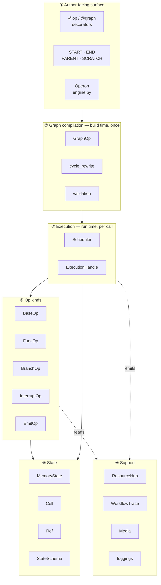
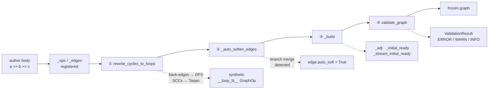
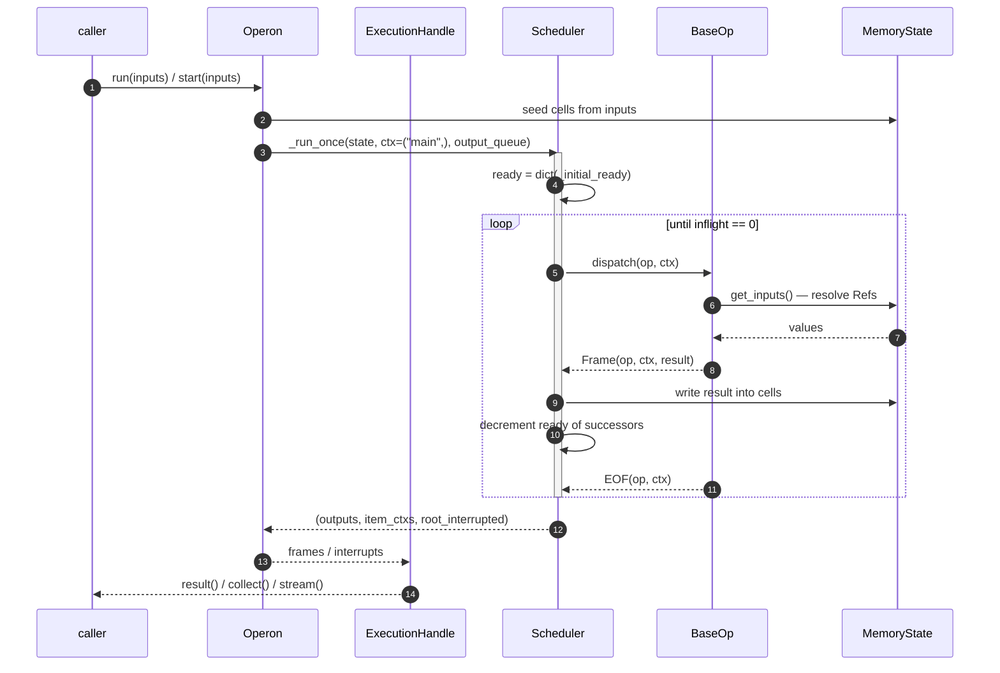
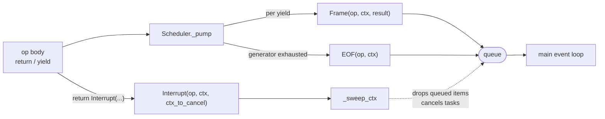
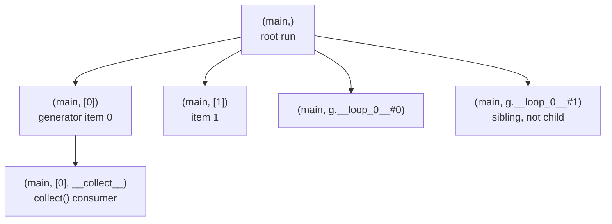
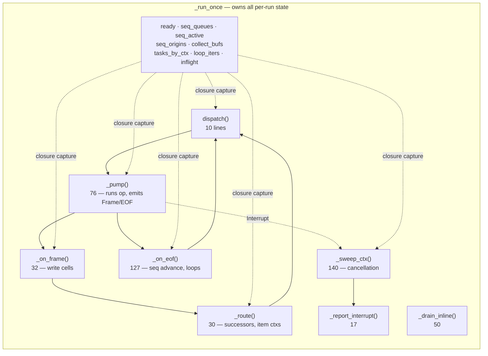
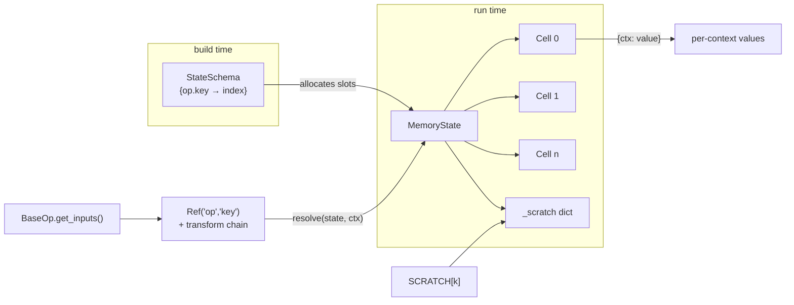
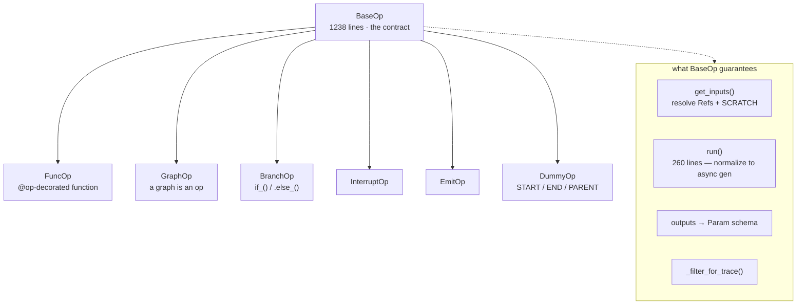

# Core package map

Every module and class in `operonx/core`, and what data moves between
them. Read this before changing core; it is the map the other
architecture pages assume you already have.

The package is **12,840 lines across ~40 modules**. It splits into six
layers, and the dependency direction is strictly downward — `states` and
`utils` never import `ops`, `ops` never imports `engine`.

---

## 1 · The two clocks

The single most important thing about core: **build time and run time are
different clocks**, and most confusion comes from mixing them.

| | Build time | Run time |
|---|---|---|
| When | `with GraphOp(...)` exits, or `@graph` first call | every `engine.run()` |
| How often | once per graph | once per call |
| Owns | `GraphOp`, `cycle_rewrite`, `validation`, `StateSchema` | `Scheduler`, `MemoryState`, `Cell` |
| Produces | frozen adjacency + ready counts | frames, cells, outputs |
| Fails with | `BuildError`, `GraphValidationError` | `OpError`, `ParserError` |

A `Ref` straddles both: it is *created* at build time as a promise, and
*resolved* at run time against `MemoryState`.

---

## 2 · Build-time flow — author code to frozen graph

`GraphOp.build()` runs four passes in a fixed order. The order matters:
cycle rewriting must happen before ready counts are computed, because it
changes the edge set.

**What each pass produces, and who consumes it:**

| Pass | Module | Writes | Read by |
|---|---|---|---|
| ① Cycle rewrite | `cycle_rewrite.py` | hidden `__loop_N__` GraphOps, `_rewritten_from` audit | scheduler (as ordinary subgraphs) |
| ② Auto-soften | `graph_op.py::_auto_soften_edges` | `edge.auto_soft` | ③, when counting predecessors |
| ③ Ready counts | `graph_op.py::_build` | `_adj`, `_initial_ready`, `_stream_initial_ready` | `Scheduler._run_once` |
| ④ Validation | `validation.py` | `ValidationResult` | the caller, as an exception or warning |

### Soft edges and the two flags

An edge carries **two** independent booleans, and conflating them is a
recurring bug:

- `auto_soft` — *derived* in pass ②. A branch's merge point fires on
  whichever branch actually ran. Forgetting this by hand used to be a
  silent run-time deadlock rather than a build error.
- `pinned_hard` — *authored*. The escape hatch when you want a merge to
  wait for every predecessor anyway.

A soft edge you wrote by hand for **trigger control** ("fire on whichever
predecessor lands first") is a third, separate thing, and is never
confused with a derived branch merge.

---

## 3 · Run-time flow — one call end to end

### The three event types

Everything the scheduler moves is one of three dataclasses from
`ops/_events.py`. User code never constructs them.

| Type | Created by | Carries | Effect |
|---|---|---|---|
| `Frame` | `_pump`, per yield | `op`, `ctx`, `result` | write cells, decrement successors |
| `EOF` | `_pump`, on exhaustion | `op`, `ctx` | release sequential queue, maybe finish |
| `Interrupt` | user op body | `op`, `ctx`, `ctx_to_cancel`, `reason` | sweep a context subtree |

`Interrupt.SELF` is a sentinel that is **deliberately not a tuple**. The
empty tuple used to be the default, and it is a prefix of every context —
so omitting the argument discarded the whole run and returned cleanly.
Now, if any path forgets to resolve it, the containment test raises
`TypeError` instead of silently matching everything.

---

## 4 · Contexts — the addressing scheme

A context is a tuple of path segments naming *which invocation* this is.
Two rules the rest of the system rests on:

- **Containment is a tuple-prefix test.** `("main","[2]")` is inside `("main",)`.
- **Loop iterations are siblings, not children.** Iteration 1 is
  `("main","g.__loop_0__#1")`, not nested inside iteration 0 — which is
  what makes termination decidable.

Nesting lives in the op **name** (`outer.sub.c`); the context carries
**iteration**.

---

## 5 · Scheduler internals

`Scheduler` is created once at build and shared across executions — it
holds **no per-run state**. Everything mutable lives in locals inside
`_run_once`, which is why concurrent runs cannot interfere.

That is also why `_run_once` is **624 lines with cyclomatic complexity 91**,
containing nine nested closures that share those locals. It is the single
most complex function in the package; the next worst is 40.

**Per-run state, and who owns each field:**

| Field | Shape | Written by | Read by |
|---|---|---|---|
| `ready` | `{ctx: {op: int}}` | `_route`, `_on_eof` | `dispatch` |
| `seq_queues` | `{gen_ctx: {op: deque}}` | `_route` | `_on_eof` |
| `seq_active` | `{gen_ctx: {op: bool}}` | `_on_eof` | `_route` |
| `seq_origins` | `{(op, item_ctx): (src,dst)}` | `_route` | `_on_eof` |
| `collect_bufs` | `{gen_ctx: {op: [...]}}` | `_on_frame` | `_on_eof` |
| `tasks_by_ctx` | `{ctx: {op: Task}}` | `dispatch` | `_sweep_ctx` |
| `loop_iters` | `{ctx: int}` | `_on_eof` | `_on_eof` |
| `inflight` | `int` | `dispatch`, `_pump` | main loop |
| `fatal` | `[BaseException]` | `_pump` | main loop |

`inflight` is the termination condition: it counts live tasks plus
unconsumed queue items, and the run ends when it reaches zero. A
`BaseException` escaping `_pump` without decrementing it hangs the run
forever — which is exactly what happened once, and why `fatal` exists.

---

## 6 · State layer

- **`Cell`** — one storage slot, `{context_id: value}`. A *shared* cell
  ignores context, which is how `PARENT.declare()` vars persist across
  stream contexts. Non-shared cells are copied per context.
- **`MemoryState`** — the cell array plus `_scratch`, identity
  (`user_id` / `session_id` / `request_id`), and four observer buses:
  `writes`, `scratch`, `custom`, `interrupt`. Checkpointers and tracers
  subscribe here rather than being called by the scheduler.
- **`Ref`** — a lazy pointer with a transform chain. `_wrap` (99 lines,
  complexity 40) is what builds those chains; comparison transforms
  capture the **literal** right-hand side, which is why Ref-vs-Ref inside
  `if_()` silently misbehaves — compute the boolean in an `@op` instead.
- **`StateSchema`** — the build-time map from `op.key` to slot index.
  **69% covered**, the thinnest coverage on any correctness-critical
  module in core.

---

## 7 · Op layer

`GraphOp` subclassing `BaseOp` is the key recursion: a subgraph is
dispatched exactly like a leaf op, and runs its own nested `Scheduler`
with `output_queue=None`. That flag — `_is_root_scheduler` — is how the
scheduler knows whether it may refuse a whole-run cancellation.

---

## 8 · Where the risk actually is

Measured, not guessed — cyclomatic complexity from `ruff C901`, coverage
from the unit suite.

| Module | LOC | Cover | Worst function | Verdict |
|---|---:|---:|---|---|
| `ops/graph/task_scheduler.py` | 853 | 87% | `_run_once` **91** | **the one real mess** |
| `states/schema.py` | 400 | **69%** | — | thinnest coverage, correctness-critical |
| `ops/base.py` | 1238 | 86% | `run` 260 lines | large but linear; holds finding C1 |
| `engine.py` | 1043 | 78% | `stream` 17 | holds findings C2, C3 |
| `ops/graph/cycle_rewrite.py` | 575 | 92% | `_synthesize_loop` 27 | hard logic, well covered |
| `states/ref.py` | 628 | 93% | `_wrap` 40 | dense but tested |

26 functions in core exceed complexity 10. Only one exceeds 45.

**Of the 22 open findings, four are core** — C1–C4. The other eighteen
live in agents, providers, and the harness. Core is the foundation worth
understanding first, but it is not where the bug density is.

---

## 9 · Suggested reading order

1. `ops/_events.py` — 3 dataclasses, 15 minutes, everything else assumes them
2. `states/cell.py` + `states/state.py` — where values live
3. `ops/graph/graph_op.py::_build` — how a graph becomes ready counts
4. `ops/graph/task_scheduler.py::_run_once` — the event loop
5. `states/ref.py` — how inputs get resolved

Related: [execution-flow.md](execution-flow.md) walks one call in
narrative form; [state-model.md](state-model.md) covers cells and
contexts in depth; [failure-modes.md](failure-modes.md) is the list of
mistakes this codebase keeps repeating — read it before any non-trivial
change.
