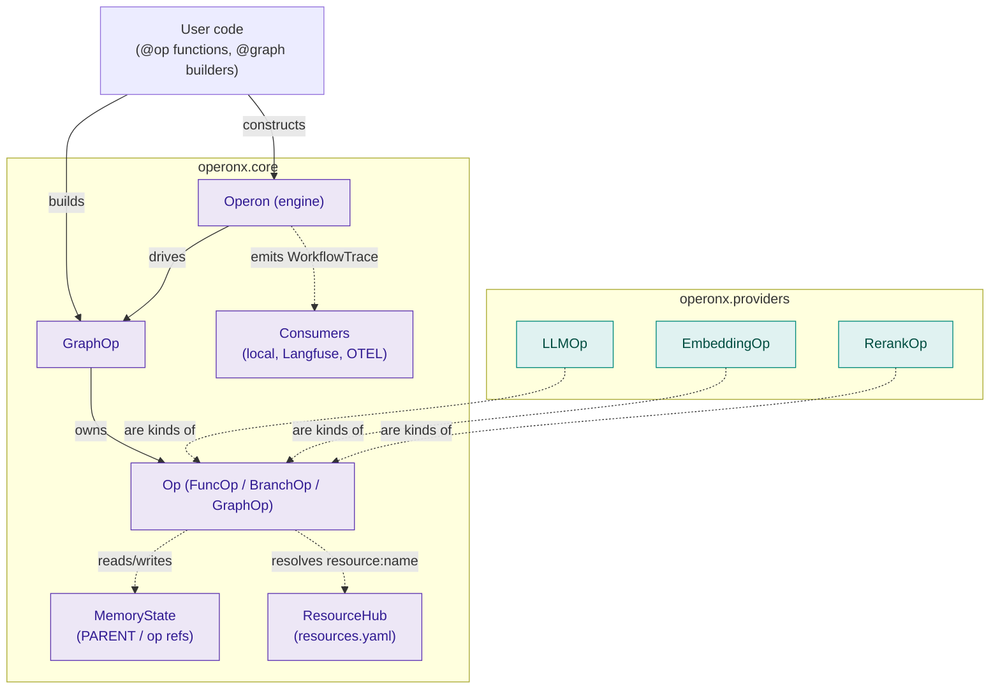

# Architecture overview

Operonx ships as a **single Python package** with optional extras.

> The Rust execution backend lives in the
> [operonx-rs](https://github.com/batman1m2001-cyber/operonx-rs) repo and
> ships as its own crate. It reads the same JSON graph spec produced by
> `graph.serialize()`, so a workflow authored in Python remains portable to
> the Rust runtime — the two projects are decoupled at the release level
> but share the JSON contract and fixture tree.

## Component map



## Source layout

```
Operonx/
├── operonx/                    # Python package
│   ├── core/                   # Engine, ops, state, tracing, registry
│   ├── providers/              # LLM, embedding, reranker, ONNX backends
│   └── telemetry/              # Consumers: local, Langfuse, OTEL
├── examples/python/            # Runnable examples
├── tests/
│   ├── internal/               # Unit tests
│   └── spec/                   # JSON-fixture tests (shared with operonx-rs)
└── docs/                       # This site
```

## Glossary

| Term | Meaning |
|---|---|
| **Engine** (`Operon`) | Pure orchestrator. Takes a graph, runs it, emits `WorkflowTrace`. |
| **Graph** (`GraphOp`) | A DAG of ops. Built with `with GraphOp(...) as g:` + `>>` edges. |
| **Op** | A node in the graph. Created via `@op`, `LLMOp.of(...)`, etc. |
| **Edge** | `>>` (hard) or `>>~` (soft, branch-conditional). |
| **Frame** | One execution step — when an op produces output, a frame is emitted. |
| **PARENT** | Marker for inputs from `engine.run()` or the parent graph. |
| **op["key"]** | Reference to a sibling op's output within the same graph. |
| **ResourceHub** | Singleton resolving `resource="gpt-4o"` → backend config. |
| **Bootstrap** | Explicit setup call: `operonx.bootstrap()` loads `.env` + `resources.yaml`. |

## Core invariants

1. **`Operon(graph)` is a pure orchestrator.** It does not load `.env` or
   `resources.yaml`. It does not clobber a pre-installed `ResourceHub`.
   See [Resource hub](resource-hub.md) for the setup model.
2. **State is referenced by symbol, not by string.** `PARENT["x"]` and
   `op["y"]` resolve through the schema layer, so renames are checked
   before the engine runs.
3. **`>> END` auto-forwards** the last op's outputs to the graph result.
   Explicit mapping uses `op["src"] >> PARENT["dest"]` or
   `outputs={"src": PARENT["dest"]}`.
4. **Ops are async-first.** Even a `def` op (no `async`) is wrapped and
   awaited by the scheduler — concurrency is the default.

## Package dependencies

```
operonx.core              (foundation — no operonx siblings)
    ↓
operonx.providers         (depends on core)
    ↓
operonx.telemetry         (depends on core)
```

## Where to read next

- [Execution flow](execution-flow.md) — engine init, warmup, run loop.
- [State model](state-model.md) — `PARENT`, `op[key]`, output mapping.
- [Streaming](streaming.md) — generator ops and frame iteration.
- [Resource hub](resource-hub.md) — the full setup model.
