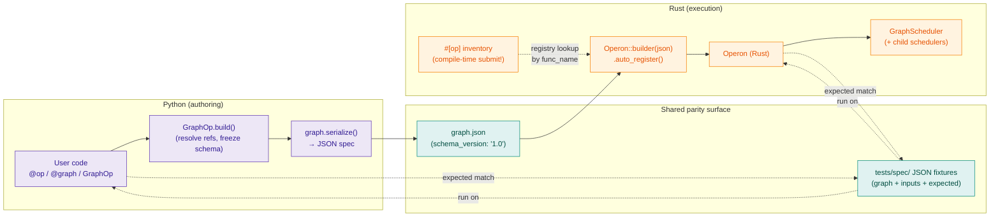

# Rust and Python

The Rust crate (`operonx`) mirrors the Python package (`operonx`) op-for-op.
Both runtimes share the same workflow JSON contract — a graph defined in
either language can run on either backend.

## Cross-runtime contract



The `tests/spec/` fixtures are the parity contract: every entry pins a
graph + inputs + expected outputs, and both runtimes must produce
identical results. Python is the canonical authoring surface; Rust
loads the JSON spec and resolves ops by `func_name` against its
`#[op]` inventory.

## When to pick which

| Workload | Recommended | Why |
|---|---|---|
| LLM / agent / RAG | Python | I/O-bound; Python's async stack is sufficient and the provider ecosystem is richer. |
| CPU-bound transforms (parsing, tokenization, math) | Rust | Faster per op, no GIL, parallel scheduler. |
| Mixed | Python with Rust plugin ops | Define hot ops as cdylib crates; Python orchestrates. |
| Edge / standalone binary | Rust | One static binary, no Python runtime. |

## Parity invariants

The two backends are kept in sync via shared JSON test fixtures under
`tests/spec/`. Each fixture pins a graph + inputs + expected outputs;
both the Python and Rust runtimes must produce identical results.

Specifically guaranteed:

- Same op semantics (`LLMOp`, `EmbeddingOp`, `RerankOp`, `BranchOp`,
  `GraphOp`, generator ops, loops).
- Same edge semantics (`>>` hard, `>>~` soft).
- Same state model (`PARENT`, `op[key]`, output mapping).
- Same five `ResourceHub` failure branches and two warnings (see
  [Resource hub](resource-hub.md)).
- `Operon::new(graph_json)` does **not** auto-load `.env` or
  `resources.yaml`, mirroring Python's `Operon(graph)` decoupling.

## Plugin ops

Custom Rust ops are registered via the `#[op]` attribute macro from the
`operonx-macros` crate. The macro emits an `inventory::submit!` so the op
is auto-discovered when the crate is compiled into the Rust runtime.

```rust
use operonx::op;
use serde_json::Value;

#[op(name = "double")]
fn double(input: &Value) -> Value {
    let x = input["x"].as_i64().unwrap_or(0);
    serde_json::json!({ "result": x * 2 })
}
```

From Python, reference the registered op by name:

```python
@op(rust="double")
def double(x: int):
    return {"result": x * 2}  # Python fallback when the Rust runtime is not used
```

`OperonBuilder::auto_register()` (Rust) collects every `#[op]`-annotated
function and adds it to the registry — no manual registration calls needed.

Runtime cdylib plugin loading (loading external `.so`/`.dll` files at
runtime) is **not currently implemented**. Plugin ops must be compiled
into the consuming binary or library.

## Build targets

| Crate | Type | How |
|---|---|---|
| `operonx` | rlib | `cd rust && cargo build --release` |
| `operonx-macros` | proc-macro | Built transitively as an `operonx` dep |
| User binaries / libraries with `#[op]`-annotated fns | bin / rlib | `cargo build --release` in the user's crate |

## Out of scope (deferred)

- Rust HTTP serve port (Axum-based). Python `operonx[serve]` is
  authoritative for now.
- Rust OTEL tracing backend. Python `operonx[otel]` is authoritative.
