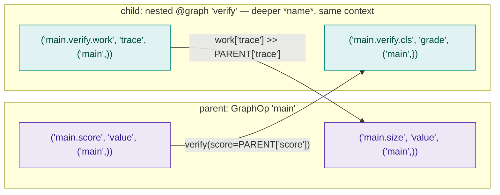

# State model

Every op has a typed input and output dict. Edges between ops are wired by
**reference**, not by string lookup at runtime.

## Cell layout

State lives in a triple-keyed cell map: `(op_full_name, var_name, context_id) → Value`.

The two keys that vary carry **different** kinds of nesting, and mixing
them up is the usual source of confusion:

- **`op_full_name` carries graph nesting.** An op inside a nested `@graph`
  is named `outer.sub.c` — the dots are the graph tree.
- **`context_id` carries *iteration*.** `("main",)` for the ordinary run,
  `("main", "[2]")` for the branch handling a generator's third yield,
  `("main", "g.__loop_0__#1")` for the second turn of a loop.

A nested graph does **not** get a deeper context. Measured on a two-level
graph, both spans run at `("main",)`:

```
outer.p       ctx=('main',)
outer.sub.c   ctx=('main',)
```



Three rules fall out of this layout:

- **`PARENT["k"]` reads from the enclosing graph.** From the child's point
  of view, `PARENT` is the graph that invoked it.
- **`op["k"]` reads from a sibling in the same graph.**
- **`op["src"] >> PARENT["dst"]` writes upward** — the scheduler emits the
  frame to both the child's own cell and the parent's slot.

Hermeticity is enforced at **build** time by name: an op inside a nested
`@graph` that references an op outside it fails to build. It is not
enforced by context, because there is no context boundary to enforce it
with.

!!! note "What this means for cancellation"
    An `Interrupt` emitted inside a nested graph resolves `Interrupt.SELF`
    to the *graph's* context — often `("main",)`. It does **not** cancel
    the whole run: a subgraph runs its own scheduler, and the sweep only
    reaches that scheduler's own tasks. The effect is correctly scoped to
    the subgraph; the reported `ctx_to_cancel` just looks broader than the
    effect. See [Execution flow](execution-flow.md#cancellation).

## PARENT vs op["key"]

**Use `op["key"]` to pass data between sibling ops. Use `PARENT["key"]`
only for external inputs** (from `engine.run()` or from the parent graph
in nested contexts).

```python
# CORRECT — read from sibling op's output
g = greet(name=PARENT["name"])      # PARENT["name"] = external input
u = upper(text=g["greeting"])       # g["greeting"] = sibling op output
START >> g >> u >> END

# WRONG — PARENT["greeting"] doesn't exist; g didn't forward there
u = upper(text=PARENT["greeting"])  # greeting is in g's state, not parent
```

| Reference | Source |
|---|---|
| `PARENT["k"]` | External inputs from `engine.run(inputs={...})` or the parent graph |
| `op["k"]` | Output from a sibling op within the same graph |
| `>> END` | Auto-forwards the last op's outputs to the graph result |

## Output mapping

Two equivalent styles. Pick whichever reads clearer:

```python
# Style 1 — outputs= parameter (inline with op creation)
llm = LLMOp.of(
    resource="gpt-4o",
    messages=p["messages"],
    outputs={"content": PARENT["answer"]},
)

# Style 2 — >> operator (standalone, equivalent)
llm = LLMOp.of(resource="gpt-4o", messages=p["messages"])
llm["content"] >> PARENT["answer"]

# Wildcard — forward all outputs
step = process(x=PARENT["x"], outputs={"*": PARENT})
```

The `>>` form is common inside loops where you want to update loop state
or forward the loop's final result.

## Schema

Every op declares a schema based on its function signature and return
annotation. The graph builder uses these schemas to:

1. Validate that `op["k"]` references an output the source op actually
   produces.
2. Validate that `PARENT["k"]` references an input the engine will be
   given.
3. Pre-compute the runtime mapping so frame propagation is O(1).

If your op returns dynamic keys, declare them with `outputs=[...]` on the
op decorator or constructor — runtime cannot infer them otherwise.

## Frames

Each op produces one or more **frames** during execution. A frame is a
snapshot of the op's output at one point in time. Most ops produce a
single frame; generator ops produce one per `yield`. The scheduler emits
frames downstream as they appear, which is what enables streaming
(see [Streaming](streaming.md)).

State within a graph is per-frame. When a generator op yields three
values, downstream ops see three independent state slices, run in
parallel by default.
