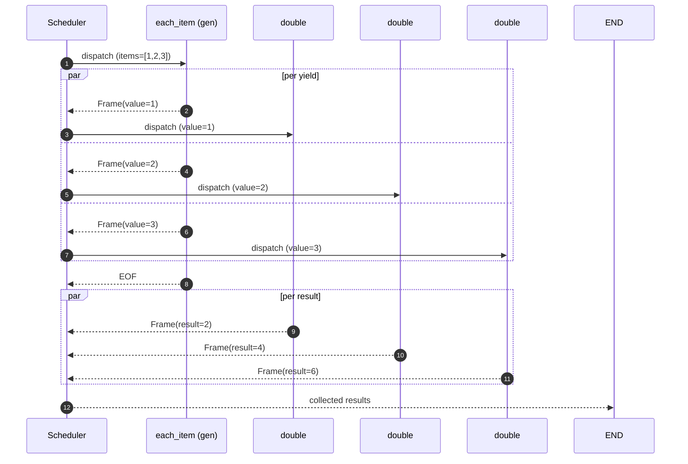

# Streaming

Operonx is **streaming-first**. The classic `ForOp` / `MapOp` / `WhileOp`
classes were replaced by two patterns: generator ops (for fan-out) and
back-edges inside `@graph` (for feedback loops, rewritten at build time
into a hidden `_GraphLoop` by the Phase 3 cycle-rewrite pass).

## Per-yield dispatch

When a generator op `yield`s, the scheduler treats each yield as an
independent frame and dispatches downstream ops in parallel — not in
a serial loop:



`G` doesn't wait for `D1` to finish before yielding the second item;
the scheduler picks frames off `G` as fast as `G` can emit them, and
each downstream `double` runs concurrently. Concurrency is bounded by
the graph's `max_stream_concurrent` (per-op semaphore) and the
runtime's `tokio` / `asyncio` thread pools.

If you want collected-list semantics — wait for all yields, then run
the next op once — apply `Ref.collect()` on the consumer's input:

```python
step = downstream(items=gen["value"].collect())
```

## Generator ops

Use `yield` inside an `@op` to iterate. Downstream ops run in parallel per
yield by default (streaming scheduler).

```python
from operonx.core import GraphOp, op, START, END, PARENT

@op
def each_item(items: list):
    for item in items:
        yield {"value": item}

@op
def double(value: int):
    return {"result": value * 2}

with GraphOp(name="iterate") as graph:
    gen = each_item(items=PARENT["numbers"])
    step = double(value=gen["value"])
    START >> gen >> step >> END
```

For `numbers = [1, 2, 3]`, `each_item` yields three frames; `double` runs
three times, in parallel — not in a serial for-loop.

If you need ordered output, collect downstream into a list op or use the
ordered-collect helper (see API reference).

## Loops via back-edge (Phase 3 rewrite)

For feedback loops where the iteration depends on the previous frame's
state, write a back-edge inside `@graph`. The build-time cycle-rewrite
pass synthesizes a hidden `_GraphLoop` for the scheduler:

```python
@graph
def counter():
    PARENT.declare(count=0)
    inc = increment(counter=PARENT["count"])
    inc["counter"] >> PARENT["count"]
    START >> inc >> if_(PARENT["count"] >= 5, END).else_(inc)
```

The `if_(...).else_(inc)` is the back-edge — else-target routes back to
an earlier op. Each iteration commits its outputs to the shared cell,
the branch reads the updated value, and decides to exit or loop again.

## Frame consumption

`engine.run(...)` returns the final result. To consume work as it happens,
use `engine.stream(...)` — and **pick the mode by which ops you need to
see**, because they do not all see the same thing.

```python
async for batch in engine.stream({"x": 1}, mode="updates"):
    print(batch)          # {"g.produce": {"chunk": "he"}}
```

| Mode | Yields | Sees |
|---|---|---|
| `"updates"` | `{op_name: {var: value}}` per op completion | **every op**, including generators in the middle of the graph |
| `"frames"` | `(op, ctx, data)` | only ops writing a graph **output** |
| `"values"` | full state snapshot per step | every op (needs a checkpointer; one is created if omitted) |
| `"custom"` | `CustomEvent` from `EmitOp` | whatever you emit, filterable by `channels=` |

### Why `"frames"` sees less

Frames *are* the graph's outputs. `handle.result()` and `handle.collect()`
are built from the same frames, so an op that only feeds a downstream
consumer emits none — widening that would put every intermediate variable
into the result.

This is the shape that matters in practice:

```python
answer = llm(prompt=p)          # streams tokens
shown  = render(text=answer)    # consumes them
```

`answer` writes no graph output, so `mode="frames"` shows nothing from it
however much it yields. `mode="updates"` shows every token, as it lands.

### Delivery is live

`mode="updates"` is paced by the state write bus, so a yield is delivered
when it happens — not batched until the graph's final output arrives.
Measured on four yields 150 ms apart: they arrive at 185/336/487/640 ms.

## Streamed LLM frames

`LLMOp(stream=True)` emits one frame per token delta and **one closing
frame carrying the whole accumulated `content`**. Both travel the same
channel, so joining every frame's `content` emits the answer twice.

`final` separates them:

```python
deltas = "".join(f["content"] for f in frames if not f["final"])
whole  = next(f["content"] for f in frames if f["final"])
assert deltas == whole
```

Join the deltas or read the final frame — never both. Batch (non-streaming)
calls are always `final=True`.

## Performance notes

- Generator ops are the default unit of fan-out. Prefer them over manual
  asyncio.gather patterns.
- Loops have a small per-iteration overhead from state propagation. For
  tight numeric loops, write the loop inside a single op instead of
  using a graph-level back-edge.
