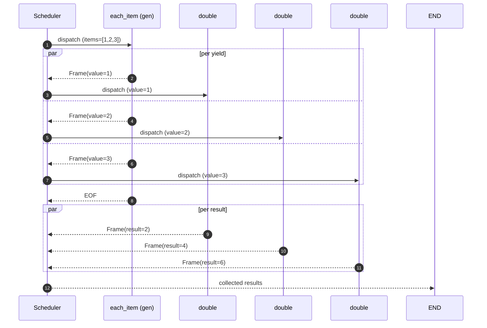

# Streaming

Operonx is **streaming-first**. The classic `ForOp` / `MapOp` / `WhileOp`
classes were replaced by two patterns: generator ops and `GraphOp.loop`.

## Per-yield dispatch

When a generator op `yield`s, the scheduler treats each yield as an
independent frame and dispatches downstream ops in parallel — not in
a serial loop:



`G` doesn't wait for `D1` to finish before yielding the second item;
the scheduler picks frames off `G` as fast as `G` can emit them, and
each downstream `double` runs concurrently. Concurrency is bounded by
the graph's `max_stream_concurrent` (per-op semaphore) and the
runtime's `tokio` / `asyncio` thread pools.

If you want collected-list semantics — wait for all yields, then run
the next op once — apply `Ref.collect()` on the consumer's input:

```python
step = downstream(items=gen["value"].collect())
```

## Generator ops

Use `yield` inside an `@op` to iterate. Downstream ops run in parallel per
yield by default (streaming scheduler).

```python
from operonx.core import GraphOp, op, START, END, PARENT

@op
def each_item(items: list):
    for item in items:
        yield {"value": item}

@op
def double(value: int):
    return {"result": value * 2}

with GraphOp(name="iterate") as graph:
    gen = each_item(items=PARENT["numbers"])
    step = double(value=gen["value"])
    START >> gen >> step >> END
```

For `numbers = [1, 2, 3]`, `each_item` yields three frames; `double` runs
three times, in parallel — not in a serial for-loop.

If you need ordered output, collect downstream into a list op or use the
ordered-collect helper (see API reference).

## Loops with `GraphOp.loop`

For feedback loops where the iteration depends on the previous frame's
state, use the loop builder:

```python
with GraphOp.loop(until="count >= 5", count=0) as loop:
    inc = increment(counter=PARENT["count"])
    inc["counter"] >> PARENT["count"]
    START >> inc >> END
```

The `until=` expression is evaluated against the current loop state after
each iteration. `inc["counter"] >> PARENT["count"]` writes the new value
back to the loop state for the next iteration to read.

## Frame consumption

Outside the engine, `engine.run(...)` returns the final state. To consume
frames as they're emitted, use the streaming entry point:

```python
async for frame in engine.stream(inputs={...}):
    print(frame.op_name, frame.outputs)
```

A frame carries the op name, the outputs dict, span context, and timing.
This is what tracers consume internally.

## Performance notes

- Generator ops are the default unit of fan-out. Prefer them over manual
  asyncio.gather patterns.
- Loops have a small per-iteration overhead from state propagation. For
  tight numeric loops, write the loop inside a single op instead of using
  `GraphOp.loop`.
