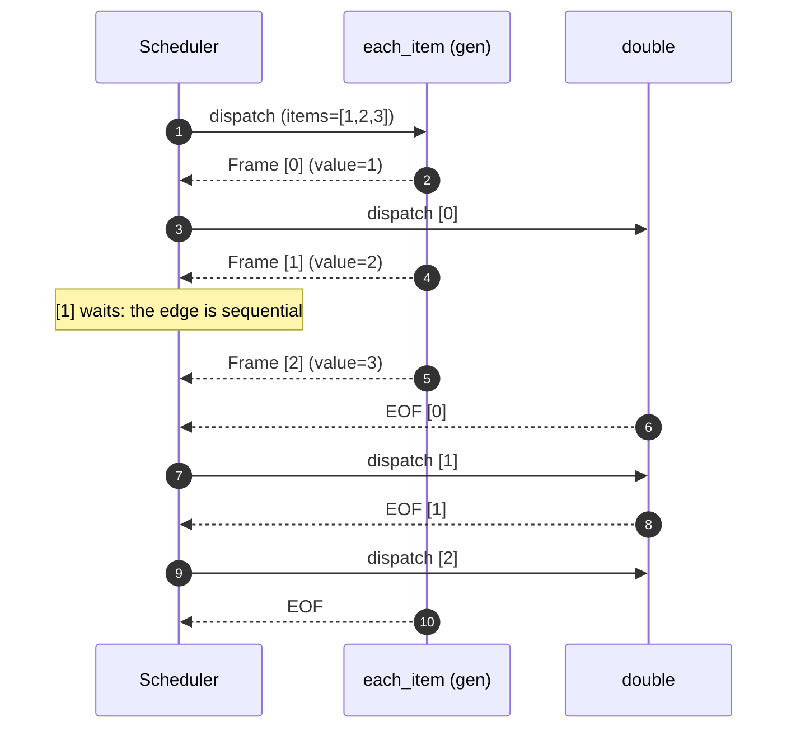

# Streaming

Operonx is **streaming-first**. The classic `ForOp` / `MapOp` / `WhileOp`
classes were replaced by two patterns: generator ops (for fan-out) and
back-edges inside `@graph` (for feedback loops, rewritten at build time
into a hidden `_GraphLoop` by the Phase 3 cycle-rewrite pass).

## Per-yield dispatch

When a generator op `yield`s, the scheduler treats each yield as a frame
with a context of its own (`("main", "[0]")`, `("main", "[1]")`, …) and
runs the downstream ops once per frame. How the frames go through a
consumer is set on the consumer's input Ref:

| Input | Items through the consumer | Order |
|---|---|---|
| `gen["value"]` (the default) | one at a time | yield order |
| `gen["value"].parallel()` | all at once | not kept |
| `gen["value"].parallel(max=N)` | at most N at once | not kept |
| `gen["value"].collect()` | the consumer runs once, after the last yield, on a list | yield order |

Sequential is the default because it keeps per-op state (a counter, a
buffer) safe when the same consumer serves several streams; reach for
`.parallel()` only for independent items. Whatever the edges say, the
graph's `concurrency=N` (default 64) caps how many op tasks run at once.


```mermaid
sequenceDiagram
    autonumber
    participant S as Scheduler
    participant G as each_item (gen)
    participant D as double

    S->>G: dispatch (items=[1,2,3])
    G-->>S: Frame [0] (value=1)
    S->>D: dispatch [0]
    G-->>S: Frame [1] (value=2)
    Note over S: [1] waits: the edge is sequential
    G-->>S: Frame [2] (value=3)
    D-->>S: EOF [0]
    S->>D: dispatch [1]
    D-->>S: EOF [1]
    S->>D: dispatch [2]
    G-->>S: EOF
```

`G` doesn't wait for `D` to finish before yielding the next item; the
scheduler takes frames off `G` as fast as `G` emits them and queues them
on the edge. A bound on that queue (`.sequential(max_pending=N)`) makes
the producer wait instead — see the [guide](https://github.com/batman1m2001-cyber/operonx/blob/main/operonx/guide/03-control-flow.md).

## Generator ops

Use `yield` inside an `@op` to iterate. Downstream ops run once per yield,
one item at a time, in yield order.

```python
from operonx.core import GraphOp, op, START, END, PARENT

@op
def each_item(items: list):
    for item in items:
        yield {"value": item}

@op
def double(value: int):
    return {"result": value * 2}

with GraphOp(name="iterate") as graph:
    gen = each_item(items=PARENT["numbers"])
    step = double(value=gen["value"])
    START >> gen >> step >> END
```

For `numbers = [1, 2, 3]`, `each_item` yields three frames and `double`
runs three times, in order. `double(value=gen["value"].parallel())` runs
the three at once.

## Loops via back-edge (Phase 3 rewrite)

For feedback loops where the iteration depends on the previous frame's
state, write a back-edge inside `@graph`. The build-time cycle-rewrite
pass synthesizes a hidden `_GraphLoop` for the scheduler:

```python
@graph
def counter():
    PARENT.declare(count=0)
    inc = increment(counter=PARENT["count"])
    inc["counter"] >> PARENT["count"]
    START >> inc >> if_(PARENT["count"] >= 5, END).else_(inc)
```

The `if_(...).else_(inc)` is the back-edge — else-target routes back to
an earlier op. Each iteration commits its outputs to the shared cell,
the branch reads the updated value, and decides to exit or loop again.

## Frame consumption

`engine.run(...)` returns the final result. To consume work as it happens,
use `engine.stream(...)` — and **pick the mode by which ops you need to
see**, because they do not all see the same thing.

```python
async for batch in engine.stream({"x": 1}, mode="updates"):
    print(batch)          # {"g.produce": {"chunk": "he"}}
```

| Mode | Yields | Sees |
|---|---|---|
| `"updates"` | `{op_name: {var: value}}` per op completion | **every op**, including generators in the middle of the graph |
| `"frames"` | `(op, ctx, data)` | only ops writing a graph **output** |
| `"values"` | full state snapshot per step | every op (needs a checkpointer; one is created if omitted) |
| `"custom"` | `CustomEvent` from `EmitOp` | whatever you emit, filterable by `channels=` |
| `"interrupts"` | `InterruptEvent` when an `InterruptOp` pauses | every `InterruptOp`; `"updates"` yields the same events among its updates |

### Why `"frames"` sees less

Frames *are* the graph's outputs. `handle.result()` and `handle.collect()`
are built from the same frames, so an op that only feeds a downstream
consumer emits none — widening that would put every intermediate variable
into the result.

This is the shape that matters in practice:

```python
answer = llm(prompt=p)          # streams tokens
shown  = render(text=answer)    # consumes them
```

`answer` writes no graph output, so `mode="frames"` shows nothing from it
however much it yields. `mode="updates"` shows every token, as it lands.

### Answering an `InterruptOp`

An `InterruptOp` waits for its answer, so a stream that hid the question
would block on it. `"updates"` yields the `InterruptEvent` after the
updates that landed before the op paused; `"interrupts"` yields only the
events. The event answers itself:

```python
async for event in engine.stream(inputs, mode="interrupts"):
    approved = ask_human(event.payload)
    event.resume(approved)   # the op outputs response=approved; False if it had stopped waiting
```

### Delivery is live

`mode="updates"` is paced by the state write bus, so a yield is delivered
when it happens — not batched until the graph's final output arrives.
Measured on four yields 150 ms apart: they arrive at 185/336/487/640 ms.

## Streamed LLM frames

`LLMOp(stream=True)` emits one frame per token delta and one closing
frame. `content` is always what a frame adds, and the closing frame adds
nothing: its `content` is `""` and the whole answer is `full_content`.
`final` marks it:

```python
assert "".join(f["content"] for f in frames) == next(f["full_content"] for f in frames if f["final"])
```

Up to 1.14 the closing frame repeated the answer under `content`, so a
consumer that forwarded each frame's `content` sent it twice. Batch
(non-streaming) calls are always `final=True`, with `content` and
`full_content` both the whole answer.

## Performance notes

- Generator ops are the default unit of fan-out. Prefer them over manual
  asyncio.gather patterns.
- Loops have a small per-iteration overhead from state propagation. For
  tight numeric loops, write the loop inside a single op instead of
  using a graph-level back-edge.
